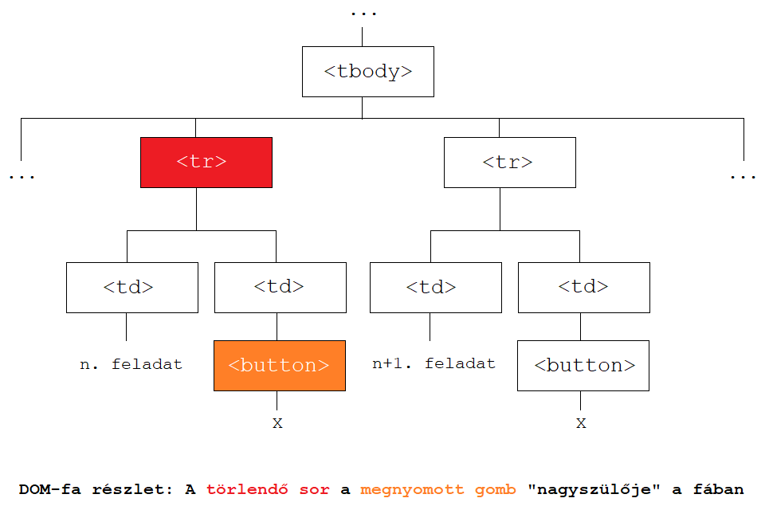

# A JavaScript DOM-manipulációs lehetőségei

Ebben a jegyzetben áttekintjük a HTML DOM-mal kapcsolatos fontosabb tudnivalókat, majd egy gyakorlati példán keresztül megismerkedünk a JavaScript által biztosított fontosabb DOM-manipulációs lehetőségekkel.


## 1. HTML DOM

A webfejlesztésben a <span class="red">HTML</span> nyelvet használjuk weboldalak létrehozására. Ennek a nyelvnek a segítségével mondhatjuk meg, hogy mi az, amit egy weboldalon látni szeretnénk (pl. szövegek, képek, táblázatok, űrlapok, multimédia stb.). Emellett a HTML lehetőséget biztosít a weboldalon megjelenő tartalom strukturálására is, különféle szakaszok, tartalmi egységek kialakításával.

A HTML dokumentumok úgy épülnek fel, hogy HTML objektumokat (úgynevezett <span class="red">tagek</span>et) ágyazunk egymásba. Ezek az objektumok egy hierarchikus fastruktúrát alkotnak a dokumentumban.

Amikor egy weboldal betöltődik, akkor a böngésző a weboldalon található HTML objektumokból elkészíti az úgynevezett <span class="red">dokumentum-objektum modell</span>t, avagy röviden a <span class="red">DOM</span>-ot. A <span class="red">DOM-fa</span> (DOM tree) segítségével könnyen szemléltethetjük a weboldalon található HTML elemek hierarchikus viszonyait.

<span class="example">Példa:</span> Egy egyszerű HTML kód és az ahhoz tartozó DOM-fa.

```html
<!DOCTYPE html>
<html lang="hu">
  <head>
    <title>DOM példa</title>
    <meta charset="UTF-8"/>
  </head>
  <body>
    <h1>Az oldal címe</h1>
    
    <p>
      <a href="https://www.youtube.com/watch?v=dQw4w9WgXcQ">Valami klassz link</a>
    </p>
  </body>
</html>
```


> **Megjegyzés:** A `DOCTYPE` nem egy HTML tag, ezért a DOM-fában sem szerepel.


### 1.1. HTML elemek DOM-beli viszonyai

Ha egy HTML dokumentumban az A objektum (nem feltétlen közvetlenül) tartalmazza a B objektumot, akkor azt mondjuk, hogy az A objektum a B objektum <span class="red">ős</span>e, a B objektum pedig A-nak <span class="red">leszármazott</span>ja. Amennyiben ez a tartalmazás <span class="orange">közvetlen</span>, akkor A-t a B <span class="red">szülő</span>jének, B-t pedig az A <span class="red">gyerek</span>ének nevezzük.

Néhány példa a fenti kódból és az ahhoz tartozó DOM-fából:

* A `<body>` objektum leszármazottjai a `<h1>`, ``, `<p>` és `<a>` objektumok, illetve a "Valami klassz link" és "Az oldal címe" szöveges csomópontok.
* A `<body>` objektum gyerekei a `<h1>`, `` és `<p>` objektumok. Másképp mondva: a `<h1>`, `` és `<p>` objektumok szülője a `<body>`.
* A `<body>` objektumnak az `<a>` objektum <span class="orange">nem</span> gyereke, csak leszármazottja, hiszen itt a tartalmazás nem közvetlen (van még a fában egy `<p>` elem is köztük).

Ha az A és B objektumok szülője megegyezik, akkor A és B egymás <span class="red">testvér</span>ei. Például a fenti kódban és az ahhoz tartozó DOM-fában a `<h1>`, `` és `<p>` elemek egymás testvérei, hiszen mindhárom elem szülője a `<body>`.

A DOM-fa tetején lévő, szülővel nem rendelkező elemet a fa <span class="red">gyökérelem</span>ének nevezzük. A teljes HTML DOM-ban a gyökérelem mindig a `<html>` objektum lesz (ugyanis ebbe ágyazunk be minden további HTML elemet).


### 1.2. A DOM gyakorlati jelentősége

Amikor a weboldalunk tartalmát CSS-ben formázzuk, akkor használhatunk olyan szelektorokat (kijelölőket) is, amelyek a DOM-beli viszonyaik alapján jelölnek ki HTML objektumokat. Néhány példa <span class="red">DOM-alapú CSS szelektorok</span>ra, a teljesség igénye nélkül:

* `div p`: kijelöl minden olyan `<p>`-t, amely egy `<div>` leszármazottja
* `div > p`: kijelöl minden olyan `<p>`-t, amely egy `<div>` gyereke
* `div ~ p`: kijelöl minden olyan `<p>`-t, amely egy `<div>` testvére és ezen `<div>` után szerepel
* `p:nth-child(n)`: kijelöl minden olyan `<p>`-t, amely a szülőjének `n`-edik gyereke
* `p:nth-of-type(n)`: kijelöl minden olyan `<p>`-t, amely a `<p>` típusú testvérei közül az `n`-edik.

A webes világban gyakran előfordul, hogy dinamikusan szeretnénk manipulálni a DOM-fát, <span class="orange">miután már a weboldal betöltődött</span> (pl. szeretnénk egy objektumot módosítani vagy törölni, esetleg egy új objektumot akarunk a fába beszúrni). Erre biztosítanak lehetőséget a <span class="red">JavaScript DOM-manipulációs műveletei</span>.

A DOM tulajdonképpen nem más, mint egy objektumorientált reprezentációja a weboldalnak. A weboldalon szereplő elemek <span class="red">Node</span>-ok (csomópontok) a DOM-fában, amelyek számos <span class="red">property</span>-vel (adattaggal) és <span class="red">metódus</span>sal rendelkeznek. Ezeket JavaScriptből egyszerűen el tudjuk érni.

A következő fejezetben megismerkedünk a JavaScript néhány fontosabb DOM-manipulációs lehetőségével. Fogjuk párszor használni a <span class="red">`document` objektum</span>ot, ami lényegében a böngésző által megnyitott HTML dokumentumot reprezentálja és hozzáférést biztosít a DOM-fához.

> **Oké, de mi értelme van ennek? Miért nem lehet csak simán a HTML-t átírogatni?**
>
> A hangsúly itt azon van, hogy azután szeretnénk a weboldal tartalmát dinamikusan módosítani, <span class="orange">miután az oldal már betöltődött</span>. Nézzünk néhány gyakorlati példát, amikor DOM-műveleteket használunk:
>
> * Lekérdezünk adatokat egy szervertől, és meg szeretnénk jeleníteni azokat a weboldalunkon. Mivel a HTML oldal már betöltődött addigra, amire az adatok megérkeztek, ezért azokat úgy tudjuk megjeleníteni a weboldalon, hogy utólag szúrogatjuk be őket a DOM-fába.
> * Egy űrlap kitöltését követően kliensoldalon ellenőrizzük a beírt adatok helyességét (pl. helyes e-mail cím formátum, helyes születési dátum stb.). Ekkor egy eseménykezelővel figyeljük, hogy mikor nyomja meg a felhasználó az "Elküldés" gombot, majd a "klikk" esemény hatására DOM-műveletekkel lekérjük a beírt adatokat és ellenőrizzük őket. (Nyilván nem tudjuk előre, hogy mit fog beírni a user, ezért kellenek a DOM-műveletek.)
> * Szeretnénk elérni, hogy egy gombra kattintva a felhasználó válthasson világos és sötét téma között. Megint az a helyzet, hogy a weboldal már be van töltve, csupán annak a megjelenítését manipuláljuk dinamikusan, DOM-műveletek segítségével, amikor a felhasználó a gombra kattint.
>
> Könnyen belátható, hogy a HTML önmagában nem elég robusztus ahhoz, hogy "utólag" manipuláljuk a weboldalaink szerkezetét. Ezért van szükségünk a DOM-ra és a JavaScript DOM-műveleteire.


## 2. JavaScript DOM-műveletek, egy példán keresztül

A jegyzet hátralévő részében egy végletekig leegyszerűsített <span class="green">feladatlista alkalmazás</span>t fogunk elkészíteni. A weboldalon megjelennek a napi feladataink, amelyeket lehetőségünk van törölni, ha teljesítettük őket. Emellett új feladatot is bármikor létrehozhatunk.

A példaprojekt elkészítéséhez szükséges <span class="green">kiinduló fájlok</span> letölthetők egy ZIP-ben, [ide kattintva](./files/dom-starter-files.zip).

> **Megjegyzés:** Mivel csak a DOM-műveletek bemutatása a cél, ezért az alkalmazás eléggé kezdetleges lesz: a feladatokat nem mentjük el sehova, így az oldal frissítésekor a dinamikusan hozzáadott adatok elvesznek. Emellett lesznek beégetett adataink is. Ha valaki ennél egy fokkal realisztikusabb weboldalt szeretne készíteni, akkor a 2.6. fejezetben talál tippeket a példaprojekt "felokosítására".


### 2.1. Objektumok megkeresése a DOM-fában

Egy egyszerű feladattal fogunk indítani: keressük meg JavaScriptben az alábbi `<h1>`-es címsort a DOM-fában, és írassuk ki azt a konzolra!

```html
<h1 id="page-title" class="text-center">Feladataim</h1>
```

HTML objektumok DOM-fában történő megkeresésére többféle lehetőségünk is van:

* <span class="red">`document.getElementById(id)`</span>: visszaadja az adott `id` értékkel rendelkező elemet (egyetlen elemet ad vissza, hiszen az `id` attribútum értéke szabályosan egyedi a HTML dokumentumon belül)
* <span class="red">`document.getElementsByTagName(tag)`</span>: visszaadja az adott tagnévvel rendelkező elemeket (minden esetben egy kollekciót ad vissza, amit 0-tól kezdődően indexelünk)
* <span class="red">`document.getElementsByClassName(class)`</span>: visszaadja az adott `class` értékkel rendelkező elemeket (minden esetben egy kollekciót ad vissza, amit 0-tól kezdődően indexelünk)
* <span class="red">`document.querySelector(s)`</span>: visszaadja az `s` CSS szelektor által kijelölt <span class="orange">legelső</span> elemet
* <span class="red">`document.querySelectorAll(s)`</span>: visszaadja az `s` CSS szelektor által kijelölt <span class="orange">összes</span> elemet (minden esetben egy kollekciót ad vissza, amit 0-tól kezdődően indexelünk).

<span class="example">Példa:</span> A felsoroltak közül bármelyik szelektorral megkereshetjük a fenti címsort. Az alábbi utasítások mindegyikének hatására a kérdéses címsor fog kiíródni a konzolra.

```js
console.log(document.getElementById("page-title"));
console.log(document.getElementsByTagName("h1")[0]);                 // kollekciót ad vissza, indexeljük!
console.log(document.getElementsByClassName("text-center")[0]);      // kollekciót ad vissza, indexeljük!
console.log(document.querySelector("header h1.text-center"));
console.log(document.querySelectorAll("header h1.text-center")[0]);  // kollekciót ad vissza, indexeljük!
```


### 2.2. Eseménykezelés

Miközben a felhasználó böngészi a weboldalunkat, történhetnek különféle <span class="red">események</span> - pl. a felhasználó rákattint egy oldalelemre, egy elem fölé viszi a kurzort, egy HTML elem betöltődik vagy megváltozik. Ezekhez az eseményekhez társíthatunk <span class="red">eseménykezelő függvények</span>et, amelyek akkor hívódnak meg, ha az adott esemény bekövetkezik.

Az eseménykezelés egyik módja, hogy az elemeknek adott, <span class="red">eseménykezeléssel kapcsolatos attribútumok</span>kal szabályozzuk az események működését. A kérdéses HTML elemet ellátjuk az alábbi attribútumok valamelyikével, és az attribútum értékeként megadjuk az eseménykezelést végző függvényt.

* `onclick`: a felhasználó rákattint az elemre
* `onload`: az elem betöltődik
* `onunload`: az oldalt bezárjuk vagy frissítjük (előfordulhat, hogy nem működik megfelelően!)
* `onmouseover`: a felhasználó az elem fölé viszi a kurzort
* `onmouseout`: a felhasználó elviszi az elemről a kurzort
* `onchange`: az elem megváltozik

> **Megjegyzés:** Ezeken kívül vannak még további eseménykezeléssel kapcsolatos attribútumok is, amiket használhatunk. A teljes listát megtalálhatjuk [ezen a linken](https://www.w3schools.com/tags/ref_eventattributes.asp).

<span class="example">Példa:</span> A példaprojektben található "Hozzáadás" gombra kattintva az `addTask()` eseménykezelő függvény hívódik meg.

```html
<button type="button" class="add-btn" onclick="addTask()">Hozzáadás</button>
```

A példaprojektben kizárólag az attribútumokkal történő eseménykezelésre találunk példát. Egy másik módszer az eseménykezelésre, ha egy DOM-beli elem <span class="red">`addEventListener()` metódus</span>át használjuk, ezzel rendeljük hozzá az elemhez az eseménykezelő függvényt (ekkor az elemnek nem kell semmilyen attribútumot adni). Egy HTML elemhez több eseménykezelő is hozzárendelhető (akár ugyanarra az eseménytípusra is).

Az `addEventListener()` metódus paraméterei sorban:

* az esemény neve, amit `on` előtag nélkül adunk meg (pl. `click`, `load`, `unload` stb.)
* eseménykezelő függvény, amely az esemény bekövetkezésekor hívódik meg
* elhagyható, logikai típusú paraméter, amely az eseménykezelő lefutásának időpontját szabályozza (bővebben lásd: "Capturing és bubbling" doboz).

<span class="example">Példa:</span> Eseménykezelő hozzárendelése egy gombhoz az `addEventListener()` metódussal.

```html
<body>
  <button type="button" id="my-btn">Kattints rám!</button>
  <script>
    const button = document.getElementById("my-btn"); // gomb megkeresése

    button.addEventListener("click", function() {  // kattintás esemény kezelése
      alert("Hurrá, működik az eseménykezelő!");
    });
  </script>
</body>
```

<div class="bordered-box border-blue">

<span class="blue">Caputring és bubbling</span>

Tegyük fel, hogy van egy HTML elemünk, ami egy másik HTML elembe van beágyazva! Mind a beágyazó elemhez, mind a beágyazott elemhez hozzárendelünk egy-egy eseménykezelőt ugyanarra az eseménytípusra - mondjuk a kattintásra. Ha a belső elemre kattintunk, akkor mindkét elem eseménykezelője meghívódik. Az `addEventListener()` metódus harmadik paraméterével szabályozhatjuk, hogy milyen sorrendben legyenek ezek meghívva.

Ha `true`-ra állítjuk a harmadik paramétert, akkor <span class="red">capturing</span> történik. Ekkor az eseményt először a legkülső elem kezeli le, majd ezután mindig az eggyel "beljebb" található elem eseménykezelő függvénye hívódik meg.

Ha `false`-ra állítjuk a harmadik paramétert, akkor <span class="red">bubbling</span> történik. Ekkor az eseményt először a legbelső elem kezeli le, majd ezután mindig az eggyel "kijjebb" található elem eseménykezelő függvénye hívódik meg. Ha nem adjuk meg expliciten a 3. paraméter értékét, akkor alapértelmezett módon mindig bubbling történik.

Nézzünk egy példát! Figyeljük meg a konzolon, hogy az "eseménykezelők" feliratra kattintva, <span class="orange">capturing esetén "kívülről befelé"</span>, míg <span class="orange">bubbling esetén "belülről kifelé"</span> sorrendben hívódnak meg az elemek eseménykezelői!

```html
<body>
  <p id="my-paragraph">
    Ez egy példa <strong id="my-strong">eseménykezelők</strong> használatára.
  </p>
  <script>
    // Két függvény, amely kiírja annak a HTML elemnek a nevét, amelyen az esemény bekövetkezett
    // A capture()-t majd capturing, a bubble()-t pedig majd bubbling módban fogjuk használni
    function capture() { console.log("Capturing: " + this.tagName); }   
    function bubble() { console.log("Bubbling: " + this.tagName); }

    // A <p> és <strong> elemek megkeresése a DOM-fában
    const p = document.getElementById("my-paragraph");      // külső (beágyazó) elem
    const strong = document.getElementById("my-strong");    // belső (beágyazott) elem
 
    // Kattintás eseményre vonatkozó eseménykezelők hozzárendelése a két elemhez
    p.addEventListener("click", capture, true);             // capturing
    strong.addEventListener("click", capture, true);        // capturing
    p.addEventListener("click", bubble, false);             // bubbling
    strong.addEventListener("click", bubble, false);        // bubbling
  </script>
</body>
```

A kimenet a konzolon: `Capturing: P`, `Capturing: STRONG`, `Bubbling: STRONG`, `Bubbling: P`.
</div>


### 2.3. Elemek beszúrása és módosítása

Ha egy új elemet szeretnénk a DOM-fába beszúrni, akkor a következő lépéseket kell követnünk:

1. A <span class="red">`document.createElement(tagname)`</span> metódussal létrehozzuk a beszúrandó HTML elemet.
1. Beállítjuk az újonnan létrehozott elem tartalmát, attribútumait és stílusát (opcionális lépés).
1. Beszúrjuk az elemet a DOM-fába a szülő objektum <span class="red">`append()`</span> vagy <span class="red">`appendChild()`</span> metódusával.

Az `append()` és `appendChild()` metódusok mindketten arra szolgálnak, hogy egy DOM-beli objektumhoz gyerekobjektumot fűzzünk hozzá. Két fontos különbség a két metódus között:

* Az `append()` egyszerre több gyereket is hozzáfűzhet egy objektumhoz, míg az `appendChild()` csak egyet.
* Az `append()` Node-okat és stringeket egyaránt hozzáfűzhet egy objektumhoz gyerekként, míg az `appendChild()` kizárólag Node-okkal működik.

> **Megjegyzés:** Az `append()` és `appendChild()` metódusok mindig a szülő elem <span class="orange">legutolsó</span> gyerekeként szúrják be az új objektumot a DOM-fába. Ha a szülő egy tetszőleges indexű gyerekeként szeretnénk beszúrni az elemet a fába, akkor használjuk a szülő **`insertBefore()`** metódusát.
>
> A metódus két paramétert vár: rendre a beszúrandó objektumot, és a szülő elem azon gyerekét, ami <span class="orange">elé</span> be fogjuk szúrni az új elemet. A szülő elemnek felhasználhatjuk a `children` property-jét, ami visszaadja az elem összes gyerekét egy indexelhető kollekcióban.
>
> Nézzünk egy példát! Szúrjunk be az alábbi weboldalra egy "Második bekezdés" feliratú `<p>` objektumot, a "Harmadik bekezdés" feliratú `<p>` elem elé!
>
> ```html
> <div id="parent">
>   <p>Első bekezdés</p>
>   <p>Harmadik bekezdés</p>
> </div>
> <script>
>   const parent = document.getElementById("parent");       // a szülő objektum
>   const newParagraph = document.createElement("p");       // az új elem létrehozása
>   newParagraph.innerText = "Második bekezdés";
>   // Az új elem beszúrása a szülő objektum második (1. indexű) gyereke elé
>   parent.insertBefore(newParagraph, parent.children[1]);
> </script>
> ```

<span class="example">Feladat:</span> Tegyük működőképessé az "új feladat hozzáadása" funkciót a példaprojektben!

<span class="example">A megoldás menete:</span>

A feladat hozzáadását végző űrlap HTML kódja a következő:

```html
<form>
  <input type="text" id="task-text" class="form-input"/>
  <button type="button" class="add-btn" onclick="addTask()">Hozzáadás</button>
</form>
```

Látható, hogy a "Hozzáadás" gombhoz hozzárendeltük az `onclick` attribútummal az <span class="green">`addTask()` eseménykezelő függvény</span>t. Ez a függvény fog meghívódni, amikor a felhasználó a gombra kattint, így <span class="orange">ennek a törzsét kell megírnunk</span>. Azt szeretnénk, hogy a függvény kérdezze le az űrlapmezőbe írt szöveget és szúrja be azt és egy "Törlés" gombot a weboldalon található táblázat egy új sorába. Valahogy így:

```html
<table>
  <!-- A táblázat fejléce... -->
  <tbody>
    <!-- Néhány korábbi feladat... -->
    <tr>
      <td>Az újonnan beszúrt feladat szövege...</td>
      <td><button type="button" class="delete-btn" onclick="deleteTask(this)">X</button></td>
    </tr>
  </tbody>
</table>
```

<div class="bordered-box border-green">
<span class="green">A feladat megoldásának lépései</span> <br>

1. Keressük meg a `<tbody>` objektumot, hiszen ennek a gyerekeként fogjuk az új feladatot beszúrni!
1. Hozzunk létre a beszúrni kívánt feladatnak egy új sort a táblázatban (`<tr>`)! A sorban helyezzünk el két táblázatcellát (`<td>`)!
1. Az első táblázatcellába írjuk bele a feladat szövegét, vagyis az űrlapon található beviteli mezőbe írt értéket!
1. A második táblázatcellában helyezzünk el egy "Törlés" gombot, a fenti kódban található mintának megfelelően!
1. Szúrjuk be a két `<td>` objektumot a `<tr>` gyerekeiként a DOM-fába! A `<tr>` objektum pedig legyen a `<tbody>` gyereke a weboldalon!
</div>

<span class="example">A megoldás elkészítése:</span>

Keressük meg a `<tbody>` objektumot!

```js
const tbody = document.getElementsByTagName("tbody")[0];
```

Hozzunk létre egy táblázatsort és két táblázatcellát! A cellákat a sor gyerekeiként, a sort pedig a `<tbody>` gyerekeként szúrjuk be a DOM-fába!

```js
const tbody = document.getElementsByTagName("tbody")[0];

const row = document.createElement("tr");
const column1 = document.createElement("td");
// Itt majd kialakítjuk az első cella tartalmát...
const column2 = document.createElement("td");
// Itt majd kialakítjuk a második cella tartalmát...

row.append(column1, column2);
tbody.append(row);
```

Írjuk bele az első táblázatcellába az `id="task-text"` attribútummal rendelkező beviteli mezőbe írt szöveget!

* Egy beviteli mezőbe írt értéket a mező **`value`** property-jével kérhetünk le.
* Egy HTML <span class="red">objektum szöveges tartalmának beállítása</span> az <span class="red">`innerText`</span> vagy <span class="red">`innerHTML`</span> property-vel lehetséges. A különbség a két property között, hogy az `innerHTML` értékeként megadott szöveg HTML-ként lesz értelmezve (ezért itt használhatók a szokásos HTML tagek), míg az `innerText` értéke minden esetben egyszerű szövegként jelenik meg (nem lesz HTML-ként értelmezve).

```js
// ...
const column1 = document.createElement("td");
column1.innerText = document.getElementById("task-text").value;
// ...
```

Már csak a második táblázatcella tartalmát kell kialakítanunk. Ebben egy törlés gombot fogunk elhelyezni, tehát a `document.createElement()` metódussal létrehozunk egy új `<button>` objektumot, amit a második táblázatcella gyerekeként szúrunk be a DOM-fába. A gomb szöveges tartalma legyen `X`!

Ahhoz, hogy a létrehozott gomb megfelelően működjön, hozzáadunk néhány attribútum-érték párt. Egy HTML <span class="red">objektum attribútumainak beállítása</span> a <span class="red">`setAttribute()`</span> metódussal történik. Ennek első paramétereként megadjuk a beállítani kívánt attribútum nevét, második paraméterként pedig az attribútum értékét.

* A `setAttribute()` segítségével adjunk a gombnak egy `type="button"` attribútum-érték párt!
* A `setAttribute()` segítségével adjunk a gombnak egy `onclick="deleteTask(this)"` attribútum-érték párt, amivel hozzárendeljük a gombhoz a `deleteTask()` eseménykezelő függvényt!

Rendeljük hozzá a gombhoz a `class="delete-btn"` attribútumot, hogy ugyanúgy legyen formázva, mint a többi törlés gomb! Ehhez használjuk az elem <span class="red">`classList`</span> property-jét, amivel lekérhetjük az összes olyan class nevét, amivel az elem rendelkezik. A `classList`-nek az **`add()`** metódusával hozzáadjuk a gombhoz a `delete-btn` class-értéket. 


```js
// ...
const column2 = document.createElement("td");
const deleteBtn = document.createElement("button");   // gomb létrehozása
deleteBtn.innerText = "X";                            // gomb szöveges tartalmának beállítása
deleteBtn.setAttribute("type", "button");             // gomb attribútumainak beállítása
deleteBtn.setAttribute("onclick", "deleteTask(this)");
deleteBtn.classList.add("delete-btn");  // class="delete-btn" attribútum hozzáadása a gombhoz
column2.append(deleteBtn);              // gomb beszúrása a DOM-fába a 2. táblázatcella gyerekeként
// ...
```

Tehát az `addTask()` függvény <span class="green">végleges verzió</span>ja a következőképpen néz ki:

```js
function addTask() {
  const tbody = document.getElementsByTagName("tbody")[0];
  const row = document.createElement("tr");

  const column1 = document.createElement("td");
  column1.innerText = document.getElementById("task-text").value;

  const column2 = document.createElement("td");
  const deleteBtn = document.createElement("button");   
  deleteBtn.innerText = "X";                           
  deleteBtn.setAttribute("type", "button");           
  deleteBtn.setAttribute("onclick", "deleteTask(this)");
  deleteBtn.classList.add("delete-btn");
  column2.append(deleteBtn);

  row.append(column1, column2);
  tbody.append(row);
  document.getElementById("task-text").value = "";  // űrlapmező tartalmának kiürítése
}
```

> **1. megjegyzés:** A `classList` egyéb metódusai a class-hozzáadásra szolgáló `add()`-on kívül:
>
> * `remove(c)`: a `c` class eltávolítása az elemről
> * `contains(c)`: szerepel-e a `c` class az elemen
> * `toggle(c)`: ha a `c` class még nem szerepel az elemen, akkor hozzáadja azt az elemhez; ha pedig már szerepel, akkor eltávolítja azt az elemről.

> **2. megjegyzés:** A példaprojektben erre nem találunk példát, de az <span class="red">objektum stílusának módosítása</span> az elem <span class="red">`style`</span> property-jével lehetséges. Ez lényegében a `style` attribútum értékének módosításával állítja be a HTML elem stílusát (ezt inline CSS-nek is nevezzük).
>
> ```html
> <body>
>   <p id="my-paragraph">I'm blue da ba dee da ba die...</p>
>   <script>
>     // A bekezdés kék betűszínűvé tétele JavaScript segítségével
>     document.getElementById("my-paragraph").style.color = "blue";
>   </script>
> </body>
> ```
>
> A `style` property-ről (ami tulajdonképpen egy objektum) szóló részletes referencia elérhető [itt](https://www.w3schools.com/jsref/dom_obj_style.asp).


### 2.4. Objektumok törlése


#### 2.4.1. Egy adott gyerekobjektum törlése

Ahhoz, hogy egy objektumot kitöröljünk a DOM-fából, szükségünk lesz a törlendő objektumra és annak szülőjére. A törléshez a szülő <span class="red">`removeChild()`</span> metódusának paramétereként adjuk meg a törlendő objektumot.

<span class="example">Feladat:</span> Tegyük működőképessé a táblázat soraiban megjelenő "Feladat törlése" gombokat!

<span class="example">A megoldás menete:</span>

Minden ilyen, feladat törlésére szolgáló gomb forráskódja a következő:

```html
<button type="button" class="delete-btn" onclick="deleteTask(this)">X</button>
```

A gombra kattintva tehát a <span class="green">`deleteTask()` eseménykezelő függvény</span> hívódik meg, így <span class="orange">ennek a törzsét kell megírnunk</span>. Azt szeretnénk, hogy a gombra kattintva töröljük ki a táblázatból azt a sort, amihez a gomb tartozik. A függvény paraméterben megkapja az aktuális objektumot (`this`), azaz a gombot, amire kattintottunk.

A törlendő sorhoz tartozó gomb tehát a függvény paramétereként adott. Ahhoz, hogy ebből megkapjuk a törlendő sort, végig kell gondolnunk a gomb és az őt tartalmazó táblázatsor viszonyát. A törlés gombok szülője egy `<td>` (cella), amelynek szülője lesz a törlendő `<tr>` (sor). Tehát <span class="orange">két szülővel kell "feljebb lépnünk" a DOM-ban</span> a megnyomott gombhoz képest. Kelleni fog még a törlendő sor szülője is, ami a `<tbody>` objektum lesz.

Mindez egy ábrán szemléltetve:



<div class="bordered-box border-green">
<span class="green">A feladat megoldásának lépései</span> <br>

1. Keressük meg a `<tbody>` objektumot, hiszen ennek az egyik gyerekét (egy táblázatsort) fogjuk kitörölni!
1. Keressük meg a megnyomott gomb "nagyszülőjét" (azaz a szülőjének a szülőjét), hiszen ez lesz a törlendő sor!
1. A `<tbody>` objektum `removeChild()` metódusával töröljük a megtalált sort a `<tbody>` gyerekei közül!
</div>

<span class="example">A megoldás elkészítése:</span>

A DOM-beli elemek <span class="red">`parentNode`</span> property-jével lekérdezhetjük az adott elem <span class="red">szülő</span>jét. Ahhoz, hogy megkapjuk a megnyomott gomb "nagyszülőjét" (a törlendő sort), kétszer egymás után alkalmazzuk a property-t.

A `deleteTask()` függvény <span class="green">végleges verzió</span>ja a következőképpen néz ki:

```js
function deleteTask(btn) {
  const tbody = document.getElementsByTagName("tbody")[0];  // <tbody> megkeresése
  const row = btn.parentNode.parentNode;  // a törlendő sor a megnyomott gomb "nagyszülője" lesz
  tbody.removeChild(row);                 // a sor kitörlése a <tbody> gyerekei közül
}
```


#### 2.4.2. Összes gyerekobjektum törlése

<span class="example">Feladat:</span> Tegyük működőképessé a weboldalon található "Összes feladat törlése" gobmot!

<span class="example">A megoldás menete:</span>

A fent említett gomb HTML forráskódja a következő:

```html
<button type="button" id="delete-all-tasks-btn" class="delete-btn" onclick="deleteAllTasks()">
  Összes feladat törlése
</button>
```

A gombra kattintva tehát a <span class="green">`deleteAllTasks()` eseménykezelő függvény</span> hívódik meg, így <span class="orange">ennek a törzsét kell megírnunk</span>. Azt szeretnénk, hogy a függvény törölje ki az összes feladatot a DOM-fából. A feladatok továbbra is a `<tbody>` gyerekeiként, táblázatsorok formájában vannak jelen a DOM-ban.

JavaScriptben nincs olyan explicit DOM-metódusunk, amely egy objektum összes gyerekét kitörölné, ezért egy kicsit másképp oldjuk meg a dolgokat:

* A szülő objektumnak (aminek a gyerek objektumait törölni akarjuk) a **`hasChildNodes()`** metódusával lekérdezzük, hogy vannak-e gyerekei.
* Amíg vannak a szülőnek gyerekei, addig a `removeChild()` metódussal mindig kitörölünk egy gyereket.

<div class="bordered-box border-green">
<span class="green">A feladat megoldásának lépései</span> <br>

1. Keressük meg a `<tbody>` objektumot, hiszen ennek az összes gyerekét (a feladatokat tartalmazó táblázatsorokat) fogjuk kitörölni!
1. Amíg van a `<tbody>`-nak gyereke, addig mindig töröljünk ki egy tetszőleges gyereket!
</div>

<span class="example">A megoldás elkészítése:</span>

Teljesen mindegy, hogy mikor melyik gyereket töröljük ki, hiszen végül minden gyereket ki fogunk törölni. A példánkban én mindig a `<tbody>` legelső gyerekét törlöm, amit a szülő **`firstChild`** property-jével érhetünk el.

Tehát a `deleteAllTasks()` függvény <span class="green">végleges verzió</span>ja a következőképpen néz ki:

```js
function deleteAllTasks() {
  const tbody = document.getElementsByTagName("tbody")[0];  // <tbody> megkeresése

  while (tbody.hasChildNodes()) {         // <tbody> összes gyerekének törlése
    tbody.removeChild(tbody.firstChild);
  }
}
```


### 2.5. A kész forráskód letöltése

A teljes, kikommentezett megoldás letölthető [ide kattintva](./files/dom-solution.zip).


### 2.6. A példaprojekt "okosabbá tétele"

* Írjuk át az alkalmazást úgy, hogy a feladatokat [LocalStorage](https://developer.mozilla.org/en-US/docs/Web/API/Window/localStorage)-ban tároljuk el és innen is töltjük be őket! A feladatok szövegeit egy tömbben tároljuk, és ezt a tömböt JSON-stringgé alakítva tároljuk el a LocalStorage-ban (mert a LocalStorage tömböket nem tud tárolni, csak stringeket)! Segítség: [JSON.stringify()](https://developer.mozilla.org/en-US/docs/Web/JavaScript/Reference/Global_Objects/JSON/stringify) és [JSON.parse()](https://developer.mozilla.org/en-US/docs/Web/JavaScript/Reference/Global_Objects/JSON/parse) metódusok.
* Ha nincs elmentett feladatunk, akkor rejtsük el a "Feladataim" szakaszt a weboldalról (`display: none`)!
* Egy új feladat hozzáadása előtt ellenőrizzük le, hogy kitöltötték-e a weboldalon található űrlapmezőt adattal! Amennyiben nem, írassunk ki hibaüzenetet!
* Ellenőrizzük, hogy ne lehessen több azonos szövegű feladatot felvenni!

> **Megjegyzés:** A "felokosított" példaprojekt letölthető [ide kattintva](./files/dom-solution-revamped.zip).


## 3. Egy rövid megjegyzés

Összetettebb webes projektekben általában nem a jegyzetben tárgyalt, hagyományos DOM-műveleteket szoktuk használni. Vannak ugyanis mindenféle <span class="red">library-k</span> és <span class="red">keretrendszerek (framework-ök)</span>, amelyek használatával jelentősen leegyszerűsödik a DOM-manipuláció megvalósítása a fejlesztők számára. Viszont mivel ezek a library-k és framework-ök önmagukban megérnének egy-egy külön jegyzetet, ezért ezekbe most nem megyünk bele.