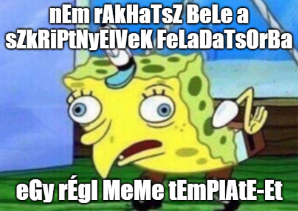

# Szkriptnyelvek - 2. gyakorló feladatsor

## Python függvények, stringek

> **Megoldás:** A feladatsor egy lehetséges megoldása elérhető <a href="./megoldas.py" target="_blank">ide kattintva</a>.

### 1. feladat: Abszolútérték-maximum (2 pont)

Írj egy `abs_max` nevű függvényt, amely két egész számot vár paraméterül, és visszatér ezek abszolútérték-maximumával! Tehát vesszük mindkét szám abszolútértékét, és ezek közül visszaadjuk a nagyobbat.

Példa:

<pre class="language-html">
<b>Input:</b> 12, -15
<b>Return:</b> 15
</pre>

### 2. feladat: Fibonacci (3 pont)

Írj egy `fibo` nevű függvényt, amely egy `n` nemnegatív egész számot kap paraméterül, és visszatér a Fibonacci-sorozat `n`-edik tagjával! Nagyobb `n`-értékek esetén iteratív vagy rekurzív megoldást érdemes használni?

    Emlékeztető: A Fibonacci-sorozat 0. eleme 0, 1. eleme 1, a többi elemet pedig mindig az előző két elem összegeként kapjuk meg. A Fibonacci-sorozat első néhány eleme (a nulladik elemtől kezdve): 0, 1, 1, 2, 3, 5, 8, 13, 21, 34, 55, 89, 144 stb.

Példa:

<pre class="language-html">
<b>Input:</b> 10
<b>Return:</b> 55

<b>Input:</b> 42
<b>Return:</b> 267914296
</pre>

### 3. feladat: Kuba (2 pont)

Kuba egy Discord szerveren moderátor. A szabadidejét sokszor azzal tölti, hogy a szerver bizonyos tagjainak a felhasználónevét átírja a következőképpen:

* a felhasználónév végére egy `.` (pont) karaktert tesz, amennyiben az eredetileg nem végződött pontra
* ellenkező esetben, pont karakterre végződő felhasználónevek esetén eltávolítja a név végéről a pontot.

Írj egy `kuba` nevű függvényt, amely egy felhasználónevet (string) kap paraméterül, elvégzi a fenti szabályok alapján a név átalakítását, majd visszatér az így kapott eredménnyel!

Példa:

<pre class="language-html">
<b>Input:</b> 'Korte12'
<b>Return:</b> 'Korte12.'

<b>Input:</b> 'Tamas.'
<b>Return:</b> 'Tamas'
</pre>

### 4. feladat: Discord emote-ok (3 pont)

Discordon lehetőségünk van különféle emote-okkal reagálni üzenetekre. Az emote-ok között megtalálhatók például az angol ábécé betűi A-tól Z-ig. Márk ezeknek az emote-oknak a használatával szeretne kirakni egy szót, viszont fontos tudni, hogy a Discord minden emote-ot csak egyszer enged felhasználni!

Írj egy `kirakhato` nevű függvényt, amely egyetlen szót (string) kap paraméterül, és visszaadja, hogy az kirakható-e úgy, hogy minden betűt csak egyszer használunk fel! A kis- és nagybetűket ne különböztessük meg!

    Tipp: Érdemes először csupa kisbetűssé (vagy csupa nagybetűssé) alakítani a szót, így például a második példában látható <code>Alma</code> szóban ismétlődő betűként kezeljük az <code>a</code> betűt.

Példa:

<pre class="language-html">
<b>Input:</b> 'Szilva'
<b>Return:</b> True

<b>Input:</b> 'Alma'
<b>Return:</b> False

<b>Input:</b> 'Gorogdinnye'
<b>Return:</b> False
</pre>

### 5. feladat: Armstrong-szám (4 pont)

A matematikában egy `n`-jegyű számot [Armstrong-szám](https://hu.wikipedia.org/wiki/Armstrong-sz%C3%A1m)nak nevezünk, ha minden számjegyét az `n`-edik hatványra emelve és összeadva az eredeti számot kapjuk. Például a 153 egy Armstrong-szám, hiszen .

Írj egy `armstrong_szam` nevű függvényt, amely garantáltan egy nemnegatív egész számot kap paraméterül, és visszaadja, hogy a paraméterben kapott szám Armstrong-szám vagy sem!

Példa:

<pre class="language-html">
<b>Input:</b> 153
<b>Return:</b> True

<b>Input:</b> 1999
<b>Return:</b> False

<b>Input:</b> 8208
<b>Return:</b> True
</pre>

### 6. feladat: Jelszó-erősség mérő (5 pont)

Elliot egy kiberbiztonsági cégnél dolgozik. Egyik nap a felettese egy jelszó-erősség mérő szkript írásával bízta meg. Készíts egy `jelszo_erosseg` nevű függvényt, amely egy jelszót (string) kap paraméterül, és visszaadja, hogy a jelszó mennyire erős! Szabályok a jelszó-erősség meghatározására:

* Alapból minden jelszó 1 erős
* Legalább 5 karakter hosszú jelszó: +1 erősség
* Legalább 8 karakter hosszú jelszó: +2 erősség
* A jelszóban szereplő minden alulvonás, kötőjel vagy pont karakter 2-vel növeli a jelszó erősségét
* Ha a jelszó tartalmazza a `jelszo` vagy az `123` részszöveget, akkor automatikusan 0 erős
* Ha a jelszó 0 karakter hosszú, akkor szintén automatikusan 0 erős.

Példa:

<pre class="language-html">
<b>Input:</b> 'hazi_macska_4_life'
<b>Return:</b> 10

<b>Input:</b> 'ez1feltorhetetlenjelszo'
<b>Return:</b> 0
</pre>

### 7. feladat: Magánhangzó eltávolítás (3 pont)

Csabi a szabadidejében sokat posztol Twitteren, viszont a posztok hosszúságára vonatkozó 280-as karakterlimitbe gyakran nem fér bele. Egyik nap kitalálta, hogy ha a posztjaiból elhagyja a magánhangzókat, akkor már kevésbé gyűlik meg a baja a karakterlimittel.

Írj egy `maganhangzot_torol` nevű függvényt, amely egy szöveget vár paraméterül! A függvény távolítsa el a szövegben található összes magánhangzót, majd térjen vissza a magánhangzók nélküli szöveggel! A paraméterül kapott szövegben ékezetes betűk garantáltan nem szerepelnek.

Példa:

<pre class="language-html">
<b>Input:</b> 'Iden Java szigeten voltunk nyaralni. Nem is tudtam, hogy elneveztek egy helyet egy programozasi nyelvrol.'
<b>Return:</b> 'dn Jv szgtn vltnk nyrln. Nm s tdtm, hgy lnvztk gy hlyt gy prgrmzs nylvrl.'
</pre>

### 8. feladat: Szöveg titkosítása (3 pont)

Robi és Misi jó barátok, sőt történetesen ugyanannál a cégnél munkatársak. Kitalálták, hogy azért, hogy a főnökük ne érthesse meg az egymásnak írt üzeneteiket, egy egyszerű titkosítást használnak. A küldő kódolja az üzenetet az elküldés előtt, a fogadó pedig visszafejti azt.

Írj egy `kodol` nevű függvényt, amely 3 paramétert kap: rendre a titkosítandó üzenetet, egy `n` pozitív egész számot, valamint egy `c` karaktert. A függvény alakítsa át az üzenetet úgy, hogy az üzenet minden betűje után `n` darab `c` karaktert tegyen! A függvény visszatérési értéke a kódolt üzenet.

Példa:

<pre class="language-html">
<b>Input:</b> 'Pizza delben?', 3, 'x'
<b>Return:</b> 'Pxxxixxxzxxxzxxxaxxx xxxdxxxexxxlxxxbxxxexxxnxxx?xxx'
</pre>

### 9. feladat: Titkosított szöveg visszafejtése (2 pont)

Természetesen Robi és Misi kommunikációjához fontos, hogy a két kolléga vissza tudja fejteni egymás kódolt üzeneteit.

Írj egy `dekodol` nevű függvényt, amely 2 paramétert kap: rendre a kódolt szöveget és egy `n` pozitív egész számot! A szöveget úgy tudjuk dekódolni, hogy a szöveg első karakterétől indulunk, mindig kihagyunk `n` darab karaktert, és a nem kihagyott karaktereket összeolvassuk. A függvény visszatérési értéke a dekódolt szöveg.

Példa:

<pre class="language-html">
<b>Input:</b> 'Pxxxixxxzxxxzxxxaxxx xxxdxxxexxxlxxxbxxxexxxnxxx?xxx', 3
<b>Return:</b> 'Pizza delben?'
</pre>

### 10. feladat: Elmozdulás (5 pont)

Írj egy `elmozdulas` nevű függvényt, amely egy útvonalat elkódoló szöveget kap paraméterül! A szövegben előforduló betűk és jelentésük: `F` (1 lépést megyünk felfelé), `L` (1 lépést megyünk lefelé),  `J` (1 lépést megyünk jobbra), `B` (1 lépést megyünk balra).

A függvény adja vissza a példában látható formátumban azt, hogy a kiinduló pozíciónkhoz képest, az útvonal követésével mennyit megyünk a vízszintes, illetve a függőleges irányba! Ha az útvonal követésével a kiinduló pozícióba érünk vissza, akkor a függvény a `Nem mentunk sehova` szöveggel térjen vissza!

Például, ha az útvonalunk a `JBBFB`, akkor 1 lépést mentünk jobbra, majd 2-t balra, 1-et fel és végül 1-et balra. Így az eredeti pozíciónkhoz képest 2 lépéssel kerültünk balra és 1 lépéssel kerültünk feljebb.

Példa:

<pre class="language-html">
<b>Input:</b> 'JJFBFFFFFFBBBL'
<b>Return:</b> '2 lepes balra, 6 lepes fel'

<b>Input:</b> 'FBLLLJLLJ'
<b>Return:</b> '1 lepes jobbra, 4 lepes le'

<b>Input:</b> 'FFF'
<b>Return:</b> '3 lepes fel'

<b>Input:</b> 'FFLLBBJJ'
<b>Return:</b> 'Nem mentunk sehova'
</pre>

### 11. feladat: Palindrom (5 pont)

A [palindrom](https://hu.wikipedia.org/wiki/Palindrom) egy olyan szó vagy szókapcsolat, amely visszafelé olvasva is ugyanaz. Például az "indul a görög aludni" egy híres példája a palindromoknak.

Írj egy `palindrom` nevű függvényt, amely egy szöveget kap paraméterül és visszaadja, hogy a paraméterben kapott szöveg palindrom-e vagy sem! A feladat megoldásának lépései:

* Először alakítsd csupa kisbetűssé a paraméterben kapott szöveget!
* Ezt követően távolítsd el a szövegből az összes szóközt, pontot, felkiáltójelet, kérdőjelet és vesszőt!
* Végül vizsgáld meg, hogy az így kapott szöveg megegyezik-e a megfordítottjával!

Példa:

<pre class="language-html">
<b>Input:</b> 'Indul a gorog aludni.'
<b>Return:</b> True

<b>Input:</b> 'kecske'
<b>Return:</b> False
</pre>

### 12. feladat: Palindromszám (3 pont)

Az előző feladatban szereplő definíció alapján könnyedén kitalálható, hogy mik a [palindromszámok](https://hu.wikipedia.org/wiki/Palindromsz%C3%A1mok): olyan számok, amelyek számjegyeit visszafelé olvasva az eredeti számot kapjuk.

Írj egy `palindromszam` nevű függvényt, amely garantáltan egy pozitív egész számot kap paraméterül, és visszaadja, hogy ez a szám palindromszám-e vagy sem!

Példa:

<pre class="language-html">
<b>Input:</b> 123454321
<b>Return:</b> True

<b>Input:</b> 2020
<b>Return:</b> False
</pre>

### 13. feladat: Idegesség detektor (5 pont)

Zsófi az egyik egyetemi projektjében CooSpace kommenteket elemez. A feladat egy egyszerű algoritmus írása, amely a komment szövege alapján eldönti, hogy a kommentet író felhasználó ideges lehetett-e a kommentírás pillanatában.

Írj egy `idegesseg_detektor` nevű függvényt, amely egy komment szövegét várja paraméterül! A függvény számolja meg, hogy összesen hány nagybetű és felkiáltójel (`!`) szerepel a komment szövegében, majd az így kapott eredményt ossza el a komment szövegének hosszával! Ha az így kapott arányszám 0.5-nél nagyobb, akkor a függvény logikai igaz, egyébként pedig logikai hamis értékkel térjen vissza!

Kezeld le azt az esetet, amikor a komment szövege egyetlen karaktert sem tartalmaz! Ekkor a függvény `None` beépített értékkel térjen vissza!

Példa:

<pre class="language-html">
<b>Input:</b> 'Hello! 3 darab AUCHANOS ZSEMLET cserelnek SURGOSEN kedd esti PROG2 gyakorlatra.'
<b>Return:</b> False

<b>Input:</b> 'KEDVES FERENC! Az EN VELEMENYEM pedig az, hogy a FELADAT KESZITOJE KIFOGYOTT az ERTELMES peldamondatokbol!!!!!!'
<b>Return:</b> True

<b>Input:</b> ''
<b>Return:</b> None
</pre>

### 14. feladat: Mocking Spongebob (4 pont)

Ki ne emlékezne az alábbi meme template-re és annak jellegzetes szövegformátumára? A feladat egy olyan függvény írása, amely egy megadott szöveget a képen látható formátumra alakít át.

Hozz létre egy `mocking_spongebob` nevű függvényt, amely egy szöveget kap paraméterül! A függvény alakítsa át a szöveget úgy, hogy a páros indexeken lévő karakterek kisbetűvel, míg a páratlan indexeken lévő karakterek nagybetűvel jelenjenek meg! A visszatérési érték az átalakított szöveg.

Példa:

<pre class="language-html">
<b>Input:</b> 'A Szkriptnyelvek meg konnyu targynak szamit.'
<b>Return:</b> 'a sZkRiPtNyElVeK MeG KoNnYu tArGyNaK SzAmIt.'
</pre>

### 15. feladat: Szövegtömörítés (6 pont)

Írj egy `tomorit` nevű függvényt, amely egy szöveget vár paraméterül! A függvény tömörítse a paraméterben kapott szöveget úgy, hogy az egymás után lévő ismétlődő karakterek helyett az ismétlődések számát és az ismétlődő karaktert jelenítse meg (így például az `aaabb` szövegből `3a2b` lesz)! A visszatérési érték a tömörített szöveg. A paraméterben kapott szöveg garantáltan legalább 1 karakter hosszú.

Példa:

<pre class="language-html">
<b>Input:</b> 'Hahooooo! Van itt valaki???'
<b>Return:</b> 'Hah5o! Van i2t valaki3?'
</pre>