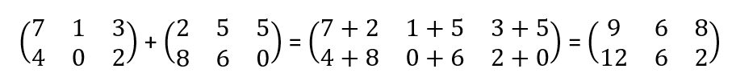

# Szkriptnyelvek - 3. gyakorló feladatsor

## Python adatszerkezetek: Lista, dictionary

### 1. feladat: Leghosszabb szó

Írj Pythonban egy `leghosszabb_szo` nevű függvényt, amely egy szöveget paraméterül! A szöveg szóközzel elválasztott szavakat tartalmaz. A függvény keresse meg a szövegben található leghosszabb szót, és térjen vissza vele! 

Ha a paraméterül kapott szöveg az üres string, akkor a visszatérési érték a `Hiba` szöveg legyen!

<pre>
<b>Input:</b> A Bekescsabarol Szegedre tarto vonat varhatoan fel orat kesik. Az okozott kellemetlensegert szives elnezesuket kerjuk.
<b>Return:</b> kellemetlensegert           
</pre>

### 2. feladat: Kiárusítás

Balázs a zsebpénzéből egy új mikrofont szeretne venni. Szerencséjére a kedvenc webshopja épp [kiárusítás](https://www.youtube.com/watch?v=qA4Ws1KOl4U)t tart, így minden szórakoztató elektronikai termék 30%-os kedvezménnyel vásárolható meg.

Írj egy `akcios_ar` nevű függvényt, amely egy listát kap paraméterül: a mikrofonok eredeti árát (egész értékek). A függvény csökkentse az árakat a 30%-os kedvezménynek megfelelően, és adja vissza az így kapott listát! Az árak itt továbbra is egész számok legyenek (ne tizedestörtek)!

**Példa:** 

<pre>
<b>Input:</b> [5000, 12000, 10000, 29000, 47000]
<b>Return:</b> [3500, 8400, 7000, 20300, 32900]
</pre>

### 3. feladat: Könyvespolc

Tünde szeret olvasni, így a polcán is számos könyv van. Egyik nap Tünde rendet rak a lakásában, és a könyveit is rendezni szeretné.

Írj egy `konyveket_rendez` függvényt, amely egy könyvcímekből álló listát vár paraméterül! A függvény rendezze a könyvek címét Z-től A-ig (tehát először rendezzük a listát ábécé sorrendbe, majd fordítsuk meg a rendezett listát)! A függvény visszatérési értéke az így kapott lista.

**Példa:**

<pre>
<b>Input:</b> ["Vajak I", "Allatfarm", "Harry Potter es a bolcsek kove", "A hobbit", "Szamitogep Architekturak"]
<b>Return:</b> ['Vajak I', 'Szamitogep Architekturak', 'Harry Potter es a bolcsek kove', 'Allatfarm', 'A hobbit']
</pre>

### 4. feladat: Votekick

Béla egy online játékkal játszik. A játékban talált egy bugot, amit kihasználva többször is be tud lépni a játékba ugyanazzal a felhasználónévvel. A játékostársai ezt nem tartják tisztességesnek, ezért úgy döntenek, hogy Bélát kirúgják a játékból.

Írj egy `belat_kirug` függvényt, amely egy listát kap paraméterül! A lista az online játékosok neveit tartalmazza (szöveges adatok). A függvény távolítsa el ebből a listából az `EpicBela20` játékosnév összes előfordulását, majd térjen vissza az így kapott listával!

**Példa:**

<pre>
<b>Input:</b> ["EpicBela20", "python4life", "EpicBela20", "EpicBela20", "kalkEasy", "varj_ez_nem_is_csgo", "sajt42"]
<b>Return:</b> ['python4life', 'kalkEasy', 'varj_ez_nem_is_csgo', 'sajt42']
</pre>

### 5. feladat: Egyedi szavak száma

Írj egy `egyedi_szavak` függvényt, amely egy szöveget kap paraméterül, és visszaadja, hogy ebben a szövegben hány **különböző** szó található!

**Példa:**

<pre>
<b>Input:</b> a progalap meg konnyu de a java meg csak azutan jon
<b>Return:</b> 9
</pre>

### 6. feladat: Gyenge jelszavak

Peti az egyik internetes fórumon azt olvasta, hogy az 5 karakternél rövidebb jelszavak könnyedén feltörhetőek. Összegyűjtötte hát azokat a jelszavakat, amiket használ, és ki szeretné válogatni azokat a jelszavakat, amelyek "gyengék", hogy minél előbb lecserélje azokat.

Írj egy `gyenge_jelszavak` függvényt, amely a jelszókat tartalmazó listát kapja paraméterül! A függvény válogassa ki a jelszavak közül az 5 karakternél rövidebbeket, és adja vissza azokat egy listában!

**Példa:**

<pre>
<b>Input:</b> ["cica", "kiscica", "nagy_macska_82", "123", "HosszuJelszoGoBrrr", "kekw", "sajt2"]
<b>Return:</b> ['cica', '123', 'kekw']
</pre>

### 7. feladat: Mátrix összeadás

Írj egy `matrix_osszead` függvényt, amely két mátrixot vár paraméterül, és visszatér azok összegével!

* A feladat megoldása során ne használj semmilyen beépített modult!
* Fontos, hogy az összeadásnál mindkét mátrix dimenziószáma megegyezzen (pl. mindkét mátrix n x m-es). Eltérő dimenziószámú mátrixok esetén a függvény térjen vissza az üres listával!
* Ha a dimenziók stimmelnek, akkor a két mátrix összegét úgy kapjuk, hogy az azonos indexen lévő elemeket összegezzük:

**Példa:**

<pre>
<b>Input:</b> [ [7, 1, 3], [4, 0, 2] ], [ [2, 5, 5], [8, 6, 0] ]
<b>Return:</b> [ [9, 6, 8], [12, 6, 2] ]
</pre>

### 8. feladat: Gyorsétterem

A kedvenc gyorséttermünkben a vásárlók belépés után sorszámot húznak, amely alapján leadhatják a rendelésüket. Az étteremben két kassza üzemel: egyiknél a páros, másiknál pedig a páratlan sorszámmal rendelkező vendégeket szolgálják ki.

Írj egy `kasszahoz_rendel` függvényt, amely egy sorszámokból (egész értékek) álló listát kap paraméterül! A függvény csoportosítsa a paraméterül kapott lista értékeit "páros", illetve "páratlan" kategóriákba! Az eredményt adja vissza egy dictionary-ben a példában látható formátumban!

**Példa:**

<pre>
<b>Input:</b> [1, 2, 3, 4, 5, 6, 7]
<b>Return:</b> { 'paros': [2, 4, 6], 'paratlan': [1, 3, 5, 7] }
</pre>

### 9. feladat: Fájlok csoportosítása

Krisztián szeretne statisztikát készíteni a Dokumentumok mappájában található fájlokról, ezért egy Python szkriptet ír. A szkript feladata, hogy megszámolja, hogy az adott mappában belül a különböző kiterjesztésű fájlokból mennyi található.

Írj egy `statisztika` nevű függvényt, amely egy listát kap paraméterül! Ez a lista tartalmazza a mappában szerepelő fájlok neveit, kiterjesztéssel együtt. A kiterjesztés alatt a **legutolsó** pont után szereplő szöveget értjük a fájlnévben. A függvény számolja meg, hogy az egyes kiterjesztések hányszor fordulnak elő a mappában, és az eredményt adja vissza egy dictionary-ben a példán látható formában!

A feladatot úgy oldjuk meg, hogy a kiterjesztés vizsgálata során ne különböztessük meg a kis- és nagybetűket (tehát pl. `hello.py` és `TEST.PY` egyaránt `py` kiterjesztésűek).

**Példa:**

<pre>
<b>Input:</b> ["feladat.py", "Bolygo.java", "HELLOFRIENDS.MP4", "TEST.PY", "biro.gib.maxpont.py", "russian-driving-fails.mp4"]
<b>Return:</b> { 'mp4': 2, 'py': 3, 'java': 1 }        
</pre>

### 10. feladat: Összpontszám

Egyik este a népszerű skribbl.io játékkal játszunk. A játék minden körében egy játékos lerajzol egy előre megadott dolgot, míg a többi játékos próbálja azt kitalálni. Az egyes körök során a játékosok pontokat gyűjtenek.

Írj egy `vegeredmeny` nevű függvényt, amely egy dictionary-kből álló listát kap paraméterül. A dictionary-k az egyes körök végeredményét tartalmazzák: a kulcsok a játékosok nevei, az értékek pedig az adott körben elért pontszám. A függvény adja össze az egyes játékosok pontjait minden körben, és az így kapott statisztikát adja vissza egy dictionary-ben a példában látható formátumban!

**Példa:**

<pre>
<b>Input:</b>
[
  { 'shronk': 400, 'Dante': 200, 'Kruzor57': 800, 'Szepi': 500, 'Karoly': 70 },
  { 'Dante': 0, 'Szepi': 0, 'Karoly': 200, 'shronk': 0, 'Kruzor57': 100 },
  { 'Szepi': 600, 'Kruzor57': 400, 'Karoly': 500, 'shronk': 200, 'Dante': 300 },
  { 'Dante': 500, 'Szepi': 100, 'Karoly': 0, 'shronk': 600, 'Kruzor57': 200 },
  { 'Kruzor57': 100, 'Szepi': 500, 'shronk': 0, 'Dante': 300, 'Karoly': 100 }
]
<b>Return:</b>
{ 'Szepi': 1700, 'Karoly': 870, 'shronk': 1500, 'Kruzor57': 1600, 'Dante': 1300 }
</pre>