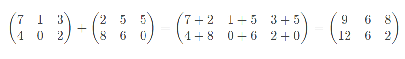

# Szkriptnyelvek - 3. gyakorló feladatsor

## Python adatszerkezetek: lista, dictionary

> **Megoldás:** A feladatsor egy lehetséges megoldása elérhető <a href="./megoldas.py" target="_blank">ide kattintva</a>.

### 1. feladat: Könyvespolc (2 pont)

Tünde szeret olvasni, így a polcán is sok könyv van. Egyik nap Tünde rendet rak a lakásában, és a könyveit is rendezi. Írj egy `konyveket_rendez` nevű függvényt, amely egy könyvcímekből álló listát kap paraméterül! A függvény rendezze a könyvek címét Z-től A-ig (tehát először rendezze a listaelemeket ábécé sorrendbe, majd fordítsa meg a rendezett listát)! A visszatérési érték az eredményül kapott lista.

Példa:

<pre class="language-html">
<b>Input:</b> ['Vajak I', 'Allatfarm', 'Harry Potter es a bolcsek kove', 'A hobbit', 'Szamitogep Architekturak']
<b>Return:</b> ['Vajak I', 'Szamitogep Architekturak', 'Harry Potter es a bolcsek kove', 'Allatfarm', 'A hobbit']
</pre>

### 2. feladat: Kiárusítás (3 pont)

Balázs a zsebpénzéből egy új mikrofont szeretne venni. Szerencséjére a kedvenc webshopja épp kiárusítást tart, így minden szórakoztató elektronikai termék akciósan vásárolható meg.

Írj egy `akcios_ar` nevű függvényt, amely két paramétert vár: a webshopban található mikrofonok eredeti árát (egész számokat tároló lista) és a leárazás mértékét százalékban (valós szám)! A függvény csökkentse a listában lévő árakat az adott százalékkal, és térjen vissza az így kapott listával! Az árak továbbra is egészek legyenek (ne tizedestörtek)!

Példa:

<pre class="language-html">
<b>Input:</b> [5000, 12000, 10000, 29000, 47000], 30.0
<b>Return:</b> [3500, 8400, 7000, 20300, 32900]
</pre>

### 3. feladat: Béla (2 pont)

Béla egy online játékkal játszik. A játékban talált egy bugot, amit kihasználva többször is be tud lépni a játékba ugyanazzal a felhasználónévvel. A játékostársai ezt nem tartják tisztességesnek, ezért úgy döntenek, hogy Bélát kirúgják a játékból.

Írj egy `belat_kirug` nevű függvényt, amely egy listát kap paraméterül, ami a játékosok neveit tartalmazza (stringek). A függvény távolítsa el a listából az `EpicBela20` játékosnév összes előfordulását, majd térjen vissza az így kapott listával!

Példa:

<pre class="language-html">
<b>Input:</b> ['EpicBela20', 'python4life', 'EpicBela20', 'EpicBela20', 'kalkEasy', 'varj_ez_nem_is_csgo', 'sajt42']
<b>Return:</b> ['python4life', 'kalkEasy', 'varj_ez_nem_is_csgo', 'sajt42']
</pre>

### 4. feladat: Leghosszabb szó (3 pont)

Írj egy `leghosszabb_szo` nevű függvényt, amely egy szöveget kap paraméterül (a szöveg szóközzel elválasztott szavakat tartalmaz)! A függvény térjen vissza a szövegben található leghosszabb szóval! Amennyiben több szó is ugyanolyan hosszú, akkor közülük a szövegben korábban előfordulót add vissza!

Ha a paraméterül kapott szöveg az üres string, akkor a visszatérési érték a `HIBA!` szöveg legyen!

Példa:

<pre class="language-html">
<b>Input:</b> 'Szia uram! Mondd mar meg, hogy hany ora van!'
<b>Return:</b> 'uram!'

<b>Input:</b> ''
<b>Return:</b> 'HIBA!'
</pre>

### 5. feladat: Gyenge jelszavak (4 pont)

Mivel Elliot felettesét nagyon lenyűgözte az 1 feladatsorral korábban megírt jelszó-erősség mérő szkript, ezért egy új feladattal bízza meg alkalmazottját. Elliotnak ki kell válogatnia a vállalat által használt jelszavak közül azokat, amelyek gyengének minősülnek.

Írj egy `gyenge_jelszavak` nevű függvényt, amely egy jelszavakat tartalmazó listát kap paraméterül! A függvény adja vissza ezek közül a gyenge jelszavakat egy listában! Egy jelszót gyengének tekintünk, ha az alábbi feltételek közül legalább 1 érvényes rá:

* A jelszó rövidebb, mint 5 karakter
* A jelszó nem tartalmaz számjegy karaktert
* A jelszó tartalmazza a `jelszo` vagy `123` szövegek valamelyikét bármilyen formában (a kis- és nagybetűket nem megkülönböztetve).

Példa:

<pre class="language-html">
<b>Input:</b> ['Root', 'Kekw2000', 'H0sszuJelszoG0esBrrr', 'Admin123456', 'sub2Pewdiepie', 'asdqwe', 'K1L0']
<b>Return:</b> ['Root', 'H0sszuJelszoG0esBrrr', 'Admin123456', 'asdqwe', 'K1L0']
</pre>

### 6. feladat: Egyedi szavak száma (5 pont)

Írj egy `egyedi_szavak_szama` nevű függvényt, amely egy szöveget kap paraméterül (a szöveg szóközzel elválasztott szavakat tartalmaz)! A függvény adja vissza, hogy hány **különböző** szó található a szövegben! 

* A kis- és nagybetűket ne különböztesd meg (tehát pl. `alma` és `ALMA` ugyanaz a szó)!
* A szavak végén lévő pontoktól, felkiáltójelektől, kérdőjelektől és vesszőktől szabadulj meg (tehát például `Alma?` és `alma` ugyanaz a szó)! Feltehetjük, hogy ezek az írásjelek csak szavak végén fordulnak elő a szövegben.

Példa:

<pre class="language-html">
<b>Input:</b> 'A macska, vagy mas neven a hazi macska kisebb termetu husevo emlos, amely a macskafelek csaladjaba tartozik.'
<b>Return:</b> 14
</pre>

### 7. feladat: Felváltva (5 pont)

Írj egy `felvaltva` nevű függvényt, amely egy több szóból álló szöveget vár paraméterben! A függvény alakítsa át a szöveget úgy, hogy az egymás utáni szavak felváltva legyenek csupa nagybetűsek, illetve csupa kisbetűsek (lásd: első példa)! A szöveg első szava mindig csupa nagybetűs. A visszatérési érték az átalakított szöveg.

Kezeld le azt az esetet, amikor a függvény egy 2-nél kevesebb szóból álló szöveget kap paraméterül! Ekkor a visszatérési érték a `HIBA!` szöveg legyen!

Példa:

<pre class="language-html">
<b>Input:</b> 'Tajekoztatjuk utasainkat, hogy a Szeged felol erkezo szemelyvonat varhatoan otven percet kesik.'
<b>Return:</b> 'TAJEKOZTATJUK utasainkat, HOGY a SZEGED felol ERKEZO szemelyvonat VARHATOAN otven PERCET kesik.'

<b>Input:</b> 'Sajt'
<b>Return:</b> 'HIBA!'
</pre>

### 8. feladat: Sorozatok (6 pont)

Ricsi nagyon szereti a sorozatokat... mármint a matematikai sorozatokat. Kedvencei a számtani és mértani sorozatok. Írj egy `sorozat` nevű függvényt, amely egy számokból álló listát kap paraméterül! A függvény döntse el, hogy a listában szereplő számok számtani, illetve mértani sorozatot alkotnak-e!

Kezeld le azt az esetet, amikor a függvény paraméterében érkező lista 3-nál kevesebb elemet tartalmaz! Ekkor a visszatérési érték a `HIBA!` szöveg legyen! Egyéb hibakezeléssel nem kell foglalkoznod.

    Emlékeztető:
    <ul>
    <li>Egy sorozatot akkor nevezünk számtani sorozatnak, ha a szomszédos elemek különbsége állandó (pl. 1, 3, 5, 7, 9 számtani sorozat, hiszen a szomszédos elemek különbsége mindenhol 2).</li>
    <li>Egy sorozatot akkor nevezünk mértani sorozatnak, ha a szomszédos elemek hányadosa állandó (pl. 1, 2, 4, 8, 16 mértani sorozat, hiszen a szomszédos elemek hányadosa mindenhol 2).</li>
    </ul>

Példa:

<pre class="language-html">
<b>Input:</b> [10, 20]
<b>Return:</b> 'HIBA!'

<b>Input:</b> [2, 3, 5, 7, 11, 13]
<b>Return:</b> 'A sorozat se nem szamtani, se nem mertani sorozat.'

<b>Input:</b> [42, 42, 42]
<b>Return:</b> 'A sorozat szamtani es mertani sorozat is egyben.'

<b>Input:</b> [9, 5, 1, -3, -7]
<b>Return:</b> 'A sorozat szamtani sorozat.'

<b>Input:</b> [2, 4, 8, 16, 32, 64, 128, 256, 512, 1024]
<b>Return:</b> 'A sorozat mertani sorozat.'
</pre>

### 9. feladat: Gyorsétterem (4 pont)

A kedvenc gyorséttermünkben a vásárlók belépés után sorszámot húznak, amely alapján leadhatják a rendelésüket. Az étteremben két kassza üzemel: egyiknél a páros, másiknál pedig a páratlan sorszámú rendeléseket szolgálják ki.

Írj egy `kasszahoz_rendel` nevű függvényt, amely egy olyan szöveget kap paraméterül, amely pontosvesszővel elválasztott (egész) számokat tartalmaz! A függvény visszatérési értéke egy 2-dimenziós lista, amely 2 részlistából áll: az első részlistába a páros, a második részlistába pedig a páratlan sorszámok kerülnek **növekvő sorrendben**.

Példa:

<pre class="language-html">
<b>Input:</b> '42;38;45;40;41;39;44;43;46'
<b>Return:</b> [[38, 40, 42, 44, 46], [39, 41, 43, 45]]

<b>Input:</b> '12;16;14'
<b>Return:</b> [[12, 14, 16], []]
</pre>

### 10. feladat: Mátrixok összeadása (6 pont)

Írj egy `matrix_osszead` nevű függvényt, amely két mátrixot (2-dimenziós listát) vár paraméterül, és kiszámítja ezen két mátrix összegét! A feladat megoldása során ne használj semmilyen beépített vagy külső Python csomagot!

Fontos, hogy az összeadásnál mindkét mátrix dimenziószáma megegyezzen (pl. mindkét mátrix `n x m`-es legyen, azaz `n` sorból és `m` oszlopból álljon). Ha a két mátrix dimenziószáma eltér, akkor a függvény térjen vissza egy üres listával! Ha a dimenziószámok megegyeznek, akkor a visszatérési érték a két mátrix összege legyen (ami szintén egy mátrix)!

    Segítség: Két mátrix összegét úgy kapjuk, hogy az azonos indexeken lévő elemeket rendre összeadogatjuk. Például:
    

Példa:

<pre class="language-html">
<b>Input:</b> [[7, 1, 3], [4, 0, 2]], [[2, 5, 5], [8, 6, 0]]
<b>Return:</b> [[9, 6, 8], [12, 6, 2]]

<b>Input:</b> [[5, 1], [3, 2], [8, 6]], [[4, 8], [2, 7]]
<b>Return:</b> []
</pre>

### 11. feladat: Szövegelemzés (4 pont)

Írj egy `szoveget_elemez` nevű függvényt, amely egy szöveget vár paraméterben! A függvény számolja meg, hogy a szövegben mennyi betű, számjegy és egyéb karakter szerepel, majd adja ezt vissza egy dictionary-ben, a példában látható formátumban!

Példa:

<pre class="language-html">
<b>Input:</b> 'Python4Life!!!'
<b>Return:</b> {'betu': 10, 'szamjegy': 1, 'egyeb': 3}

<b>Input:</b> '12345'
<b>Return:</b> {'betu': 0, 'szamjegy': 5, 'egyeb': 0}
</pre>

### 12. feladat: Kurzuskódok (5 pont)

Informatikus szakon többféle kurzust is felvehetünk. Az informatikával kapcsolatos tárgyak kurzuskódja `I` betűvel, a matekos tárgyak kurzuskódja `M` betűvel, míg a szabadon választható tárgyak kurzuskódja `X` betűvel kezdődik.

Írj egy `kurzuskodot_csoportosit` nevű függvényt, amely egy olyan szöveget kap paraméterül, ami pontosvesszővel elválasztott kurzuskódokat tartalmaz! A függvény csoportosítsa a szövegben szereplő kurzuskódokat "infós", "matekos" és "szabvál" kategóriákba, majd adja vissza az így kapott csoportosítást egy dictionary-ben, a példában látható formátumban! Ha a paraméterben kapott érték az üres string, akkor a függvény egy üres dictionary-vel térjen vissza!

Példa:

<pre class="language-html">
<b>Input:</b> 'IB370G;MBNXK114E;MBNXK114G;XA0021-GTK-MM1;IB370E'
<b>Return:</b> {'infos': ['IB370G', 'IB370E'], 'matekos': ['MBNXK114E', 'MBNXK114G'], 'szabval': ['XA0021-GTK-MM1']}

<b>Input:</b> 'ITN714G;IB402g;XN0011-01317;IB202g'
<b>Return:</b> {'infos': ['ITN714G', 'IB402g', 'IB202g'], 'matekos': [], 'szabval': ['XN0011-01317']}

<b>Input:</b> ''
<b>Return:</b> {}
</pre>

### 13. feladat: Fájlok csoportosítása (5 pont)

Krisztián szeretne statisztikát készíteni a Dokumentumok mappájában található fájlokról, ezért egy Python szkriptet ír. A szkript feladata, hogy megszámolja, hogy az adott mappán belül mennyi található a különböző kiterjesztésekből. A program egy részét Krisztián már megírta, viszont a statisztika-készítésben kellene neki egy kis segítség.

Írj egy `statisztika` nevű függvényt, amely egy listát kap paraméterül! A lista fájlok neveit tartalmazza, kiterjesztéssel együtt. A fájlnévben a kiterjesztés alatt a **legutolsó** pont karakter után lévő szöveget értjük. A függvény számolja meg, hogy az egyes kiterjesztések hányszor fordulnak elő a listában, és az eredményt adja vissza egy dictionary-ben, a példában látható formátumban!

A feladatot úgy oldd meg, hogy a kiterjesztés vizsgálata során ne különböztesd meg a kis- és nagybetűket (tehát pl. `hello.py` és `WORLD.PY` egyaránt `py` kiterjesztésűek).

Példa:

<pre class="language-html">
<b>Input:</b> ['feladat.py', 'Bolygo.java', 'HELLOFRIENDS.MP4', 'TEST.PY', 'biro.gib.maxpont.py', 'russian-driving-fails.mp4']
<b>Return:</b> {'py': 3, 'java': 1, 'mp4': 2}
</pre>

### 14. feladat: Végeredmény (5 pont)

Egy baráti társaság a népszerű [skribbl.io](https://skribbl.io/) játékkal játszik. A játék minden körében egy játékos lerajzol egy előre megadott dolgot, amit a többiek megpróbálnak kitalálni. Az egyes körök során a játékosok pontokat gyűjtenek.

Írj egy `vegeredmeny` nevű függvényt, amely egy dictionary-kből álló listát kap paraméterül! A dictionary-k az egyes körök eredményeit tartalmazzák: a kulcsok a játékosok nevei, az értékek pedig az adott körben a játékos által elért pontszám. A függvény összesítse játékosonként a pontokat, és az így kapott összesítést adja vissza egy dictionary-ben, a példában látható formátumban!

Példa:

<pre class="language-html">
<b>Input:</b>
[
  { 'shronk': 400, 'Tamas': 200, 'adam': 800, 'Wolf': 500, 'Karoly': 70 },
  { 'Tamas': 0, 'Wolf': 0, 'Karoly': 200, 'shronk': 0, 'adam': 100 },
  { 'Wolf': 600, 'adam': 400, 'Karoly': 500, 'shronk': 200, 'Tamas': 300 },
  { 'Tamas': 500, 'Wolf': 100, 'Karoly': 0, 'shronk': 600, 'adam': 200 },
  { 'adam': 100, 'Wolf': 500, 'shronk': 0, 'Tamas': 300, 'Karoly': 100 }
] 
<b>Return:</b> {'shronk': 1200, 'Tamas': 1300, 'adam': 1600, 'Wolf': 1700, 'Karoly': 870}
</pre>

### 15. feladat: Szöveges végeredmény (3 pont)

A 14. feladatban szereplő, végeredményeket tartalmazó dictionary tartalmát szöveges formátumban is meg szeretnénk jeleníteni. Írj egy `szoveges_vegeredmeny` nevű függvényt, amely egy pontszám-statisztikákat tartalmazó dictionary-t kap paraméterül! A függvény járja be a dictionary kulcs-érték párjait, képezzen belőlük `{kulcs}: {ertek} pont` formátumú szövegeket, amiket 1 vesszővel és 1 szóközzel elválasztva fűzzön össze (a szöveg végén ne szerepeljen se vessző, se szóköz)! A visszatérési érték az így kapott szöveg.

Példa:

<pre class="language-html">
<b>Input:</b> {'shronk': 1200, 'Tamas': 1300, 'adam': 1600, 'Wolf': 1700, 'Karoly': 870}
<b>Return:</b> 'shronk: 1200 pont, Tamas: 1300 pont, adam: 1600 pont, Wolf: 1700 pont, Karoly: 870 pont'
</pre>

### 16. feladat: Győztes (3 pont)

Természetesen a skribbl.io-s játék végén azt is tudni szeretnénk, hogy ki nyert. Írj egy `gyoztes` nevű függvényt, amely egy pontszám-statisztikát tartalmazó dictionary-t kap paraméterül (mint az előző feladatban)! A függvény térjen vissza annak a játékosnak a nevével, akinek a legtöbb pontszáma van! Amennyiben több azonos pontszámú játékos van a dictionary-ben, akkor a korábban előforduló játékos nevét add vissza!

Példa:

<pre class="language-html">
<b>Input:</b> {'shronk': 1200, 'Tamas': 1300, 'adam': 1600, 'Wolf': 1700, 'Karoly': 870}
<b>Return:</b> 'Wolf'
</pre>