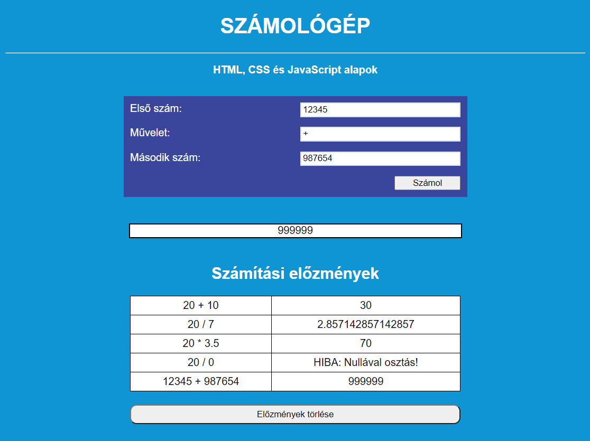

# Szkriptnyelvek - 5. gyakorló feladatsor

## HTML, CSS, JavaScript alapok

A feladat egy egyszerű weboldal elkészítése, amely tartalmaz egy számológépet, amely segítségével a 4 alapműveletet (összeadás, kivonás, szorzás és osztás) végezhetjük el. A számológép alatt egy táblázat található, amely a számítási előzményeinket tartalmazza.

**Példa az elkészítendő weboldalra:**

### Az oldal kialakítása

* A weboldal tetején jelenjen meg egy `8. gyakorlat` feliratú, `h1`-es címsor, vízszintesen középre igazítva!
* A címsor alatt jeleníts meg egy `HTML, CSS és JavaScript alapok` feliratú bekezdést, vízszintesen középre igazítva!
* Alakítsd a weboldal tetején lévő címsort csupa nagybetűssé!
* Állítsd át a weboldalon szereplő összes szöveg betűtípusát Arial-ra!
* Állítsd át a weboldal háttérszínét az alapértelmezettről egy számodra szimpatikus színre!
* JavaScript segítségével módosítsd az oldal tetején lévő címsor szövegét a `Számológép` feliratra!
* JavaScript segítségével tedd félkövér betűstílusúvá a címsor alatt megjelenő bekezdést!

### Számológép

* Hozz létre egy `div` objektumot, amely a számológépet fogja tartalmazni! Az objektumot igazítsd vízszintesen középre, illetve ízlés szerint adj neki margót, valamint térközt!
* A `div` objektumon belül hozd létre a következő elemeket, rácsos elrendezést (grid layout) használva:
    * egy beviteli mező az egyik számnak
    * egy beviteli mező a műveleti jelnek
    * egy beviteli mező a másik számnak
    * egy gomb, amire kattintva elvégezzük a számítást!
* A gombra kattintva számítsd ki az űrlapmezőkbe beírt számolás eredményét JavaScriptben!
    * Ellenőrizd, hogy mindhárom beviteli mező ki legyen töltve! Amennyiben valamelyik beviteli mezőnek nem adtuk meg az értékét, írass ki hibaüzenetet! (**Tipp:** A nem kitöltött űrlapmezők alapértéke az üres string.)
    * Ha az űrlapmezők megfelelően lettek kitöltve, akkor végezd el a beírt számítást! Kezeld le a következő speciális eseteket:
        * nullával történő osztás
        * a négy alapművelettől eltérő műveleti jel megadása!
    * A kiszámolt eredményt jelenítsd meg a számológép alatt egy `div`-en belül!

### Számítási előzmények

* Hozz létre egy vízszintesen középre igazított táblázatot a számológép alatt, amely a számítási előzményeket fogja tartalmazni! A táblázat csak akkor legyen látható, ha már elvégeztünk legalább egy számítást!
* Miután a számológéppel elvégzünk egy számítást, fűzzünk hozzá egy új sort a táblázathoz! A sor két táblázatcellát tartalmazzon: a számítást (a két szám és az operátor), illetve az eredményt!
* A táblázat alatt legyen egy `Előzmények törlése` feliratú gomb, ami szintén csak akkor jelenjen meg, ha már elvégeztünk legalább egy számítást! A gombra kattintva töröljük a táblázatból az összes sort, majd tüntessük el a táblázatot a weboldalról!
