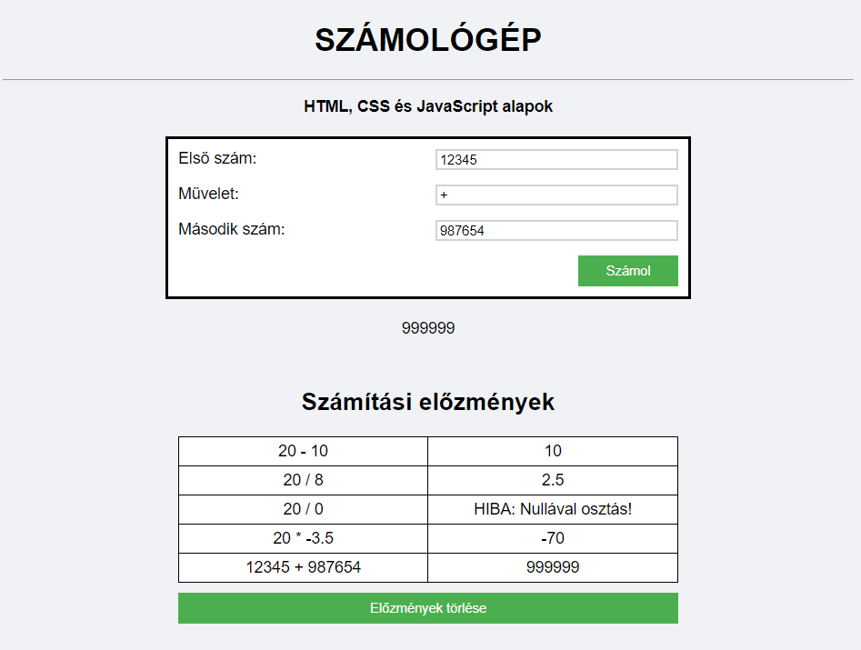

# Szkriptnyelvek - 6. gyakorló feladatsor

## HTML és CSS ismétlés, JavaScript DOM-műveletek

A feladat egy egyszerű weboldal elkészítése, amely tartalmaz egy számológépet, amely segítségével a 4 alapműveletet (összeadás, kivonás, szorzás, osztás) végezhetjük el. A számológép alatt egy táblázat található, amely a számítási előzményeinket tartalmazza.

Példa az elkészítendő weboldalra:

A feladatsor megoldásához szükséges kiinduló fájlok letölthetők [ide kattintva](./calculator.zip).

### 1. Az oldal kialakítása (11 pont)

* Alakítsd át a weboldal karakterkódolását úgy, hogy az ékezetes betűk is helyesen megjelenjenek! **(1 pont)**

* A weboldalon található `<h1>`-es címsor alá szúrj be HTML-ben egy `HTML, CSS és JavaScript alapok` feliratú bekezdést, amely a `class="center"` attribútummal rendelkezzen! **(1,5 pont)**

* Ágyazd be a style.css nevű külső stílusfájlt a HTML dokumentumba! A feladatsorban szereplő CSS formázásokat ebbe a fájlba írd bele! **(1 pont)**

* CSS segítségével állítsd át a weboldal háttérszínét az alapértelmezettről egy tetszőleges színre! **(1 pont)**

Tipp: A háttérszín kiválasztásához használhatjuk például <a href="https://htmlcolorcodes.com/color-picker/">ezt az online színválasztó eszközt</a>.

* CSS segítségével állítsd át a `<body>`-ban megjelenő összes szöveges tartalom betűtípusát Arial-ra! Ha az Arial nincs telepítve a felhasználó gépén, akkor állíts be egy másik talp nélküli ("sans-serif") betűtípust! **(1,5 pont)**

* CSS segítségével alakítsd csupa nagybetűssé az `id="title"` attribútummal rendelkező oldalelemet! **(1 pont)**

* CSS segítségével igazíts minden `class="center"` attribútummal rendelkező (szöveges) elemet vízszintesen középre! **(1 pont)**

* A `setupSite()` függvényben JavaScript segítségével keresd meg a weboldal tetején lévő `<h1>`-es címsort, és módosítsd a szöveges tartalmát a `Számológép` feliratra! **(1,5 pont)**

* A `setupSite()` függvényben JavaScript segítségével keresd meg a `<h1>`-es címsor alá beszúrt bekezdést, és tedd félkövér betűstílusúvá (a `class="bold"` attribútum hozzárendelésével)! **(1,5 pont)**

### 2. A számológép működőképessé tétele (10 pont)

Írd meg a "Számol!" gombra kattintáskor meghívásra kerülő `calculate()` függvény törzsét!

* Kérd le a számológép űrlapon megadott három adatot (a két számot és a műveleti jelet)! **(1 pont)**

* Ellenőrizd, hogy mindhárom űrlapmező ki legyen töltve adattal! Amennyiben valamelyik beviteli mezőt üresen hagyta a felhasználó, akkor jeleníts meg egy hibaüzenetet a weboldalon! **(2 pont)**

Tipp: A nem kitöltött űrlapmezők alapértéke az üres string.

* Ha az űrlapmezők megfelelően lettek kitöltve, akkor végezd el a beírt számítást! Írass ki hibaüzenetet, ha nullával szeretnénk osztani vagy a négy alapművelettől eltérő műveleti jelet adunk meg! **(5 pont)**

* A függvény írja be az `id="result"` attribútummal rendelkező objektumba a kiszámolt eredményt! **(2 pont)**

### 3. Számítási előzmények táblázat (9 pont)

* Miután a számológéppel elvégzünk egy számítást, fűzz hozzá egy új sort az `id="history-table"` attribútummal rendelkező táblázathoz, az `addToHistory()` függvénnyel!
    * A sor két táblázatcellát tartalmazzon: a számítást (a két számot és a műveleti jelet), illetve az eredményt! 
    * A táblázatot tartalmazó `
`-en szereplő `class="hidden"` attribútum eltávolításával tedd láthatóvá a táblázatot és az alatta lévő gombot! **(6 pont)**

* Írd meg az "Előzmények törlése" gombra kattintáskor meghívódó `clearHistory()` függvény törzsét! A gomb megnyomásakor töröld a táblázatból az összes sort, és rejtsd el a táblázatot tartalmazó `
`-et a weboldalról (a `class="hidden"` attribútum segítségével)! **(3 pont)**
