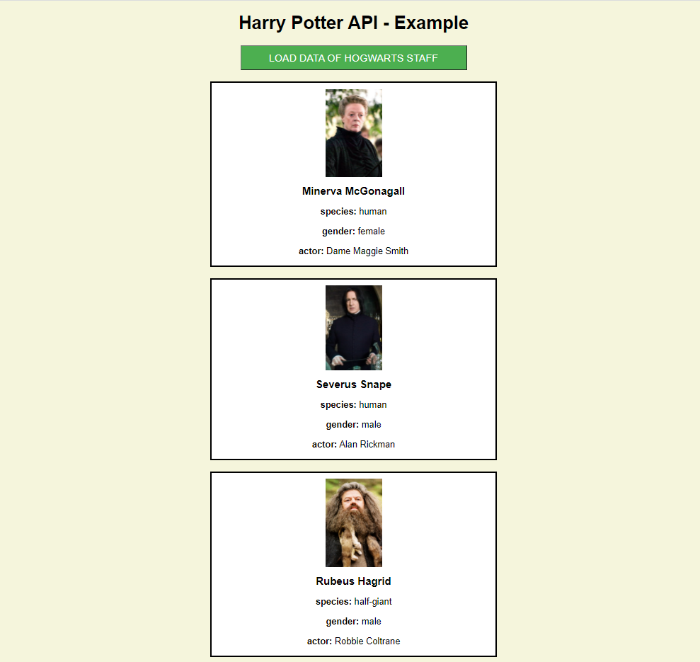

# Szkriptnyelvek - 10. gyakorló feladatsor

## Aszinkron programozás JavaScriptben

Segítség: A feladatsor megoldásához hasznos lehet <a href="../../js-async" target="_blank">az aszinkron JavaScripttel kapcsolatos jegyzetem</a>.

> **Megoldás:** A feladatsor egy lehetséges megoldása elérhető <a href="./megoldas.zip" target="_blank">ide kattintva</a>.

### Aszinkron adatlekérdezés Promise-ok használatával (10 pont)

* Keress az interneten egy számodra szimpatikus API-t, amely valamilyen adatokat tesz elérhetővé a fejlesztők számára! Ne a jegyzetben bemutatott JSON placeholder-es API-t használd, hanem valami mást! Néhány egyszerűen használható API (természetesen nem kötelező pont ezek valamelyikét használni):
    * [The Cat API](https://docs.thecatapi.com/) - Véletlenszerű macskás kép adatai
    * [The Dog API](https://docs.thedogapi.com/) - Véletlenszerű kutyás kép adatai
    * [Dad Joke API](https://icanhazdadjoke.com/api) - Véletlenszerű angol nyelvű faviccek
    * [Cat Fact API](https://catfact.ninja/) - Véletlenszerű tények macskákról
    * [Harry Potter API](https://hp-api.herokuapp.com/) - Harry Potter szereplők adataival kapcsolatos egyszerű API (itt az adatlekérés előtt át kell írni az URL-ben a `http`-t `https`-re).

* Hozz létre egy HTML weboldalt, amin helyezz el egy gombot! Amikor a felhasználó a gombra kattint, akkor kérdezd le a kiválasztott API-tól az adatokat JavaScript segítségével! Az adatlekéréshez használd a jegyzetben látott Promise-okat (akár az `async` és `await` kulcsszavakkal)!

* A lekérdezett adatokat jelenítsd meg a weboldalon!

Egy lehetséges példa az elkészítendő weboldalra (részlet):

    Megjegyzés: Mivel itt alapvetően az aszinkron JavaScripten van a hangsúly, nem a weboldal kinézetén, ezért a beadott megoldásokban nem kötelező CSS formázásokat használni (az oldal kinézete nem lesz pontozva).

