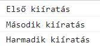
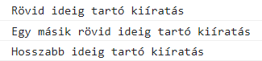
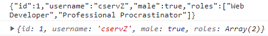
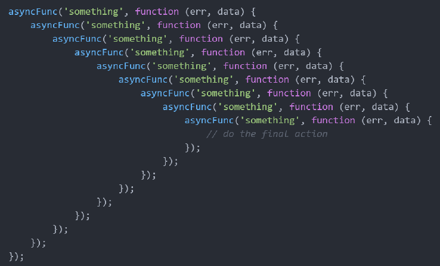
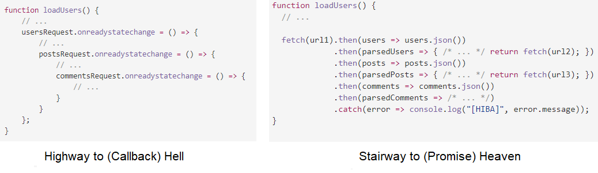

# Aszinkron programozás JavaScriptben

Ebben a jegyzetben meghatározzuk a szinkron, illetve az aszinkron programkód fogalmát, majd ezután megnézzük, hogy a JavaScript milyen lehetőségeket biztosít aszinkron adatok feldolgozására. Részletesen áttekintjük a callback függvényeket, a Promise-okat, illetve az `async` és `await` kulcsszavak használatát.


## 1. Szinkron és aszinkron kódrészek

A programjainkban a <span class="red">szinkron kódrészek</span> esetén <span class="orange">az egyes utasítások sorban, egymás után hajtódnak végre</span>. Tehát ebben az esetben először mindig megvárjuk, hogy az aktuális utasításunk végrehajtása befejeződjön, még mielőtt rátérnénk a következő utasítás végrehajtására.

<span class="example">Példa:</span> Ha a JavaScript kódunkban több `console.log()` szerepel egymás után, akkor ezek szinkron módon kerülnek végrehajtásra: mindig megvárjuk az aktuális kiíratás végrehajtását, még mielőtt rátérnénk a következő kiíratásra.

```js
console.log("Első kiíratás");
console.log("Második kiíratás");
console.log("Harmadik kiíratás");
```

<div class="bordered-box border-black">
<span class="black">A fenti kód kimenete a konzolon:</span><br>

</div>

Ezzel szemben az <span class="red">aszinkron kódrészek</span> esetén <span class="orange">az egyes utasítások egymástól függetlenül hajtódnak végre</span>. Tehát itt nem várjuk meg, amíg az egyes utasítások végrehajtása befejeződik, hanem egyszerre hajtunk végre több, egymástól független utasítást (<span class="orange">"multitasking"</span>).

JavaScriptben a `setTimeout()` függvény egy tipikus példája az aszinkron utasításoknak. Ezzel a függvénnyel egy megadott hosszúságú "szünetet" rakhatunk a programunkba. Miután ez a "szünet" letelt, végrehajtunk egy utasítássorozatot (amit egy callback függvényként adunk meg).

<span class="example">Példa:</span> Mivel a `setTimeout()` aszinkron módon működik, ezért az alábbi példában az utolsó `console.log()` nem fogja megvárni, amíg a `setTimeout()` a 2 másodperces "szünet" után kiíratja a "Hosszabb ideig tartó kiíratás" szöveget, hanem még ezelőtt lefut.

```js
console.log("Rövid ideig tartó kiíratás");
// 2 másodperc (2000 milliszekundum) "szünet" után kiíratunk valamit a konzolra
setTimeout(() => console.log("Hosszabb ideig tartó kiíratás"), 2000);
console.log("Egy másik rövid ideig tartó kiíratás");
```

<div class="bordered-box border-black">
<span class="black">A fenti kód kimenete a konzolon:</span><br>

</div>

Az aszinkron programozás egyik fő motivációja a felhasználói élmény (user experience) javítása. Ha például van egy webes alkalmazásunk, amely valamilyen adatlekérést végez (pl. adatbázisból kér le adatokat), akkor az adatlekérés aszinkron módon történő kezelésével elérhetjük, hogy a felhasználó továbbra is gond nélkül használhassa az alkalmazásunkat, amíg az adatlekérés fut a háttérben (így nem "fagy le" az alkalmazás az adat megérkezéséig).


## 2. Aszinkron JavaScript

Ebben a fejezetben egy példán keresztül nézzük meg, hogy hogyan lehet JavaScript segítségével aszinkron módon adatot lekérdezni egy webszervertől.

A webes szolgáltatás, amit használni fogunk a példáinkban a **[https://jsonplaceholder.typicode.com/](https://jsonplaceholder.typicode.com/)**. Ennek az úgynevezett API-nak a segítségével különféle, JSON formátumú mintaadatok (pl. felhasználók, felhasználók posztjai, a posztokra érkező kommentek stb.) iránt indíthatunk HTTP kéréseket.

Ha valaki számára az imént említett fogalmak (HTTP üzenet, API, JSON formátum) ismeretlenek lennének, akkor a 2.1. és 2.2. fejezetekben ezek röviden bemutatásra kerülnek.


### 2.1. HTTP üzenetek, API-k

Ha az alkalmazásunkban szeretnénk egy webszervertől elkérni valamilyen erőforrást (pl. egy képet, egy HTML fájlt, JSON formátumú adatot stb.), akkor a böngészőnkkel egy <span class="red">HTTP kérés</span>t indítunk a szerver felé az adott erőforrás iránt.

A szerver a megkapott HTTP kérést feldolgozza, és arra egy <span class="red">HTTP válasz</span>t küld vissza. Amennyiben "minden rendben volt", akkor a szerver visszaküldi a böngészőnknek a kért erőforrást a válaszüzenetben. Ekkor a HTTP válaszban szereplő <span class="red">státuszkód</span> a `200 OK`. Ha valamilyen hiba történt a kliens-szerver kommunikáció során, akkor a HTTP válaszban egy `200 OK`-tól eltérő státuszkód szerepel (pl. `404 Not Found`, ha a kért erőforrás nem található a szerveren).

A HTTP kéréseknek két fő fajtáját különböztetjük meg:

* A <span class="red">`GET`-kérések</span> segítségével jellemzően egy erőforrást kérünk el a szervertől (ebben a jegyzetben csak ilyen típusú HTTP kérésekre fogunk példát nézni).
* A <span class="red">`POST`-kérések</span> segítségével jellemzően adatot továbbítunk a szerver felé (pl. egy kitöltött űrlap adatait).

Manapság az interneten elérhető rengeteg különféle <span class="red">API</span> (Application Programming Interface = alkalmazásprogramozási felület), amik bárki által felhasználható, nyilvános adatokat tesznek elérhetővé a fejlesztők számára. Mi most egy felhasználói mintaadatokat rendelkezésünkre bocsátó API-t fogunk használni, de ezen kívül természetesen rengeteg hasznos API megtalálható a weben (pl. aktuális időjárással kapcsolatos adatok, menetrendekkel kapcsolatos információk, véletlenszerű macskás/kutyás képek stb.).


### 2.2. A JSON formátum

A webes kommunikáció során gyakran használjuk a <span class="red">JSON</span> (JavaScript Object Notation) formátumot adatok továbbítására. Ez egy emberek számára is könnyen olvasható, szöveges formátum.

A JSON formátum által támogatott alapvető adattípusok:

* szám
* szöveg (idézőjelek között adhatjuk meg)
* logikai típus (`true` vagy `false` értéke lehet)
* tömb
* objektum.

<span class="example">Példa:</span> Az alábbi JSON objektum egy felhasználót reprezentál.

```json
{
  "id": 1,
  "username": "cservZ",
  "male": true,
  "roles": ["Web Developer", "Professional Procrastinator"]
}
```

A JSON formátum típusai és a JavaScript típusai között az alábbi függvényekkel végezhetünk átalakításokat:

* <span class="red">`JSON.stringify()`</span>: egy JavaScript értékből készít egy JSON formátumú szöveget
* <span class="red">`JSON.parse()`</span>: egy JSON formátumú szövegből készít egy JavaScript értéket.

<span class="example">Példa:</span> JavaScript és JSON formátum közötti átalakítások.

```js
const user = {id: 1, username: "cservZ", male: true, roles: ["Web Developer", "Professional Procrastinator"]};

const jsonString = JSON.stringify(user);            // object -> JSON
console.log(jsonString);
const retrievedUser = JSON.parse(jsonString);       // JSON -> object
console.log(retrievedUser);
```

<div class="bordered-box border-black">
<span class="black">A fenti kód kimenete a konzolon:</span> Az első kiíratás eredménye egy JSON formátumú szöveg, a másodiké pedig egy hagyományos JavaScript object.<br><br>

</div>


### 2.3. A JavaScript lehetőségei aszinkron adatlekérésre

Legyen az a feladatunk, hogy kérdezzük le aszinkron módon a **[https://jsonplaceholder.typicode.com/users](https://jsonplaceholder.typicode.com/users)** URL-en található felhasználói adatokat a böngészőben, JavaScript segítségével!

Az alábbiakban megnézünk 3 módszert, aminek segítségével lehetőségünk van aszinkron adatlekérésre JavaScriptben. Ezek közül a Promise-ok és az `async`/`await` kulcsszavak a mai napig gyakran használatosak (a callback függvények kevésbé - hamarosan látni fogjuk, hogy miért).


#### 2.3.1. Callback függvények

A <span class="red">callback függvények</span>et már jól ismerjük a korábbi JavaScriptes tanulmányainkból. Ezek <span class="orange">olyan függvények, amelyeket egy másik függvénynek adunk paraméterül</span>. Természetesen a callback függvényt meg is tudjuk hívni abban a függvényben, amely paraméterül kapja azt.

Ebben a jegyzetben a callback függvények megadására az ECMAScript6 (ES6) szabványban bevezetett <span class="red">arrow function</span>-öket fogjuk használni. Ha esetlegesen valakinek ez a fogalom idegen, akkor érdemes lehet elolvasni a gyakorlati jegyzet ide vonatkozó részét ([link](https://okt.sed.hu/szkriptnyelvek/gyakorlat/gyak9/#javascript-fuggvenyek-egyeb-megadasi-modjai)).

<span class="example">Példa:</span> A korábban látott `setTimeout()` függvény első paraméterében egy callback függvényt adtunk meg, ami a megadott idő lejárta után került meghívásra.

```js
setTimeout(() => {
  // Ez egy callback függvény, amely 2 másodperc eltelte után fog meghívódni...
  console.log("Lejárt a 2 másodperces szünet!");
}, 2000);
```

##### Aszinkron adatlekérés callback függvény használatával

A callback függvényeket aszinkron adatok (pl. egy webszervertől lekérdezett adatok) feldolgozására is használhatjuk. Intuitív módon az aszinkron adatok feldolgozását kiszervezzük egy callback függvénybe, amit akkor fogunk majd meghívni, miután az adatok megérkeztek.

<span class="example">Feladat:</span> Indítsunk HTTP GET kérést a minta API-ban szereplő felhasználók adatai iránt, majd jelenítsük meg a lekért adatokat a weboldalunkon! Az adatok megjelenítését egy callback függvény segítségével végezzük!

<div class="bordered-box border-green">
<span class="green">A feladat megoldásának lépései</span> <br>

1. Létrehozunk a weboldalunkon egy gombot, amihez hozzárendelünk egy `loadUsers()` eseménykezelő függvényt. Ez a függvény akkor kerül meghívásra, ha a gombra kattintunk (`onclick` attribútum).
1. Megírjuk a `loadUsers()` függvény törzsét, amely egy HTTP GET kérést indít az API-ban szereplő felhasználók adatai iránt. A függvény egy callback függvényt vár paraméterben, amit akkor hívunk meg, miután a lekérdezett adatok rendben megérkeztek.
1. Létrehozunk egy `displayUsers()` nevű függvényt, amely a `loadUsers()` függvénynek átadott callback függvény lesz. Ez paraméterül kapja a lekérdezett felhasználók adatait egy tömbben, és megjelenít ezek közül néhány adatot a weboldalon (pl. a felhasználók nevét és e-mail címét).
</div>

A HTTP kérés indításához az <span class="red">`XMLHttpRequest`</span> objektumot fogjuk használni ([részletes referencia](https://developer.mozilla.org/en-US/docs/Web/API/XMLHttpRequest)).

* Az objektum `open()` metódusával egy megadott típusú (jellemzően GET vagy POST) HTTP kérést kezdeményezhetünk egy megadott URL-címre.
* A `responseType` adattaggal megadhatjuk a szervertől várt válasz típusát. Például, ha megmondjuk, hogy JSON formátumú választ várunk, akkor a válaszban szereplő adatok alapból JavaScript formátumban fognak rendelkezésünkre állni (nem kell őket `JSON.parse()`-szal konvertálgatni).
* A `send()` metódussal ténylegesen elküldjük a kérést a szerver felé.
* Az `onreadystatechange` eseménykezelő értékeként megadható egy olyan függvény, amely akkor kerül meghívásra, ha a HTTP kérés állapota (`readyState` adattag) megváltozik (pl. megérkezett a szervertől az adat).
    * Ha a `readyState` adattag értéke 4, akkor a szerverhez indított HTTP kérés végbement.
    * Ha a `status` adattag értéke 200, akkor a válasz sikeresen megérkezett (`200 OK` státuszkód).

<span class="green">A callback függvénnyel megvalósított adatfeldolgozás kódja:</span>

```html
<body>
  <!-- Ha erre a gombra kattintunk, akkor lekérdezzük az API-ban szereplő felhasználók adatait. -->
  <button onclick="loadUsers(displayUsers)">Felhasználók adatainak lekérdezése</button>
  <!-- Ebben a div-ben fogjuk megjeleníteni a lekérdezett felhasználói adatokat. -->
  <div id="data-container"></div>

  <script>
    // A felhasználói adatok lekérdezéséért felelő függvény.
    function loadUsers(callback) {
      const url = "https://jsonplaceholder.typicode.com/users"; // Az URL, ahova a kérést indítjuk.
      const request = new XMLHttpRequest();       // A kérés objektum, amivel a szerverhez fordulunk.
      request.responseType = "json";              // A szervertől érkező válasz JSON formátumú lesz.
      request.open("GET", url);                   // Egy HTTP GET kérést nyitunk az adott URL-re.

      request.onreadystatechange = () => {        // Mi történjen a válasz megérkezésekor?
        // Ha minden rendben volt, akkor meghívjuk a callback függvényt a lekérdezett adatokkal.
        if (request.readyState === 4 && request.status === 200)
          callback(request.response);
      };

      request.send();                // A kérés elküldése a szervernek.
      console.log(request.response); // Az aszinkronság miatt itt még nem áll rendelkezésre az adat (null)!
    }

    // A lekérdezett adatok weboldalon való megjelenítéséért felelő függvény.
    function displayUsers(users) {
      const dataContainer = document.getElementById("data-container");  // A felhasználók adatait tároló div.
      dataContainer.innerHTML = "";              // A div-ben szereplő esetleges korábbi adatok eltüntetése.

      for (let user of users) {                  // Az egyes felhasználók adatainak megjelenítése.
        const userContainer = document.createElement("div");
        userContainer.innerHTML = `<h3>${user.name}</h3><p>Email: ${user.email}</p>`;
        dataContainer.append(userContainer);
      }
    }
  </script>
</body>
```

##### Egy fontos probléma: callback hell

A callback függvények kapcsán felmerül egy fontos probléma: bizonyos esetekben előfordul, hogy <span class="orange">több callback függvényt kell egymásba ágyaznunk</span>. Például, ha a fenti példában szereplő felhasználók adatainak lekérdezése után le szeretnénk kérdezni a felhasználók posztjait, majd a posztok lekérése után a posztokra érkező kommenteket is le akarjuk kérni, akkor a kódunk valahogyan így fog kinézni:

```js
function loadUsers() {
    // ...
    usersRequest.onreadystatechange = () => {
        // ...
        postsRequest.onreadystatechange = () => {
            // ...
            commentsRequest.onreadystatechange = () => {
                // ...
            }
        }
    };
}
```

Látható, hogy az egymásba ágyazott callback függvények hatására a kódunk elkezd "szétcsúszni": egyre beljebb és beljebb kerülünk az indentálási szinteket illetően. Ezt a jelenséget, amikor a kódunk "szétcsúszik" az egymásba ágyazott callback függvények hatására, <span class="red">callback hell</span>-nek (callback pokolnak) nevezzük. A callback hell-re egy még extrémebb példát láthatunk az alábbi ábrán ([az ábra forrása](https://javascript.plainenglish.io/the-practical-problems-with-callbacks-in-javascript-5dd4209c20d)).



A callback hell egy igen jelentős és gyakran felmerülő probléma a callback függvényekkel kapcsolatban, ami miatt <span class="orange">manapság már nem szoktak hagyományos callback függvényeket használni aszinkron adatok feldolgozására</span>! A hagyományos callback függvények helyett például használhatjuk az úgynevezett Promise-okat, amik már megoldják a callback hell problémáját (a következő fejezetben megnézzük, hogy hogyan).


#### 2.3.2. Promise-ok

A <span class="red">Promise</span>-ok ("ígéretek") az ECMAScript6 (ES6) szabványban kerültek bevezetésre az aszinkron adatkezelés megkönnyítése céljából. Egy Promise tulajdonképpen egy objektum, amely egy olyan aszinkron adatot reprezentál, ami jelen pillanatban még nem ismert, de a későbbiek során ismertté válhat (pl. miután a HTTP kérésünk elküldését követően megkapjuk a felhasználók adatait a webszervertől, akkor ezek az adatok ismertté válnak).

A Promise-oknak <span class="red">3 lehetséges állapot</span>a létezik:

* <span class="red">Pending:</span> folyamatban (elküldtük a kérést az adatok iránt, de a válasz még nem jött meg)
* <span class="red">Fulfilled:</span> teljesítve (a lekért aszinkron adat sikeresen megérkezett a válaszban)
* <span class="red">Rejected:</span> elutasítva (valamilyen hiba miatt nem sikerült az adattovábbítás).

<div class="bordered-box border-blue">
<span class="blue">Egy hétköznapi analógia: "az ígéret szép szó..."</span><br><br>

A Szkriptnyelvek gyakorlaton a gyakorlatvezető megígérte a hallgatóknak, hogy készít egy jegyzetet az aszinkron programozásról. Ekkor az ígéret lesz maga a Promise objektum.

* Onnantól kezdve, hogy a gyakorlatvezető kimondta ezt az ígéretet, a Promise "pending" állapotba kerül. Ez azt jelenti, hogy folyamatban van a jegyzet elkészítése, de nem tudjuk előre, hogy az valóban elkészül-e.
* Ha a gyakorlatvezető ténylegesen megírta a jegyzetet, akkor az ígéretét betartotta, ezáltal a Promise "fulfilled" (teljesített) állapotba került.
* Ha a gyakorlatvezető hanyag volt és nem készítette el az ígért jegyzetet, akkor ezáltal megszegte az ígéretét, így a Promise "rejected" (elutasított) állapotba került.
</div>

A Promise-ok működését két oldalról érdemes megnéznünk. Az aszinkron adatok elküldését végző fél (a szerver) létrehozza a Promise objektumot, míg az aszinkron adatokat fogadó fél (a kliens) felhasználja a Promise-t.

* A <span class="red">küldő</span> (a szerver) példányosítja a `Promise` osztályt. Ekkor a Promise még "pending" állapotban van. A konstruktor egy 2-paraméteres függvényt vár paraméterben. Mindkét paraméter 1-1 callback függvény lesz.
    * Az első paraméterben kapott callback függvényt - nevezzük azt mondjuk `resolve()`-nak - akkor hívja meg a küldő, ha "minden rendben volt". Ekkor a `resolve()` függvény paraméterében adja meg a küldő az elküldésre szánt aszinkron adatot. Ekkor a Promise "fulfilled" állapotba kerül.
    * A második paraméterben kapott callback függvényt - nevezzük azt mondjuk `reject()`-nek - akkor hívja meg a küldő, ha valamilyen hiba történt. Ekkor a `reject()` paraméterében adja meg a küldő azt a hibát, ami miatt nem sikerült elküldeni a kért adatot. Ekkor a Promise "rejected" állapotba kerül.
* A <span class="red">fogadó</span> (a kliens) alapvetően kétféle dolgot csinálhat a megkapott Promise objektummal:
    * Ha a Promise állapota "fulfilled", tehát a kért adat megérkezett, akkor a Promise <span class="red">`then(data)` metódus</span>ával a fogadó feldolgozza a megkapott adatot (itt a `data` paraméter a küldőtől megkapott adatot jelenti).
    * Ha a Promise állapota "rejected", tehát valami hiba történt, akkor ezt a hibát a Promise <span class="red">`catch(error)` metódus</span>ával a fogadó lekezelheti (itt az `error` paraméter a küldőtől megkapott hiba).

<span class="example">Példa:</span> A `sendData()` függvény egy Promise-ként adja vissza a kért adatot, amit aztán a `getData()` függvény dolgoz fel. Ha a `data` konstans értéke `undefined` lenne, akkor a `catch()` metódus futna le a `getData()` függvényben.

```js
getData();

// Az aszinkron adat elküldését végző függvény.
function sendData() {
  const data = {id: 1, "username": "cservZ", "male": true};   // Ez lesz az elküldendő adat.

  return new Promise((resolve, reject) => {  // Egy Promise-t adunk vissza.
    if (data !== undefined)     // Ha minden rendben volt, elküldjük az adatot.
      resolve(data);
    else                        // Egyébként pedig egy hibát küldünk el.
      reject(new Error("Hiba történt a kérés teljesítése során!"));
  });
}

// Az aszinkron adat feldolgozását végző függvény.
function getData() {
  // Ha minden rendben volt, kiíratjuk a kapott adotot a `then()` ágban, hiba esetén pedig
  // a megkapott hibaüzenetet íratjuk ki a `catch()` ágban.
  sendData().then(data => console.log(data)).catch(error => console.log("[HIBA]", error.message));
}
```


##### Aszinkron adatlekérés Promise-ok használatával

Láttuk, hogy a Promise-ok segítségével hatékonyan lehet aszinkron adatokat küldeni és fogadni. Mi most az aszinkron adatok fogadásával fogunk részletesebben foglalkozni.

<span class="example">Feladat:</span> Kérdezzük le a korábbiakban használt API-ban szereplő felhasználók adatait, ezúttal Promise használatával! A lekért adatokat jelenítsük is meg a weboldalon!

<div class="bordered-box border-green">
<span class="green">A feladat megoldásának lépései</span> <br>

1. Ismételten fel fogjuk használni a felhasználói adatokat megjelenítő `displayUsers()` függvényt, ezért kimásoljuk annak a kódját a callback-es példából.
1. Az adatlekérést végző `loadUsers()` függvényben most a `fetch()` függvényt ([részletes referencia](https://developer.mozilla.org/en-US/docs/Web/API/fetch)) fogjuk felhasználni a felhasználói adatok lekérésére. Ez a függvény egy Promise-t ad vissza.
1. Ha az adatot tartalmazó szerver-válasz rendben megérkezett, akkor a kapott Promise `then()` ágában feldolgozzuk azt.
    - Ehhez először meghívjuk a kapott szerver-válasz `json()` metódusát, ami JavaScript formátumra konvertálja át a kapott adatot. Ez a metódus szintén egy Promise-szal tér vissza.
    - A `json()` metódushoz tartozó Promise `then()` ágában már egy JavaScript formátumra alakított adattal dolgozunk (a felhasználók tömbjével). Ezt megjeleníthetjük a weboldalon.
1. Ha valamilyen hiba történt, akkor a kapott Promise `catch()` ágában kiíratjuk a hibaüzenetet.
</div>

<span class="green">A Promise-szal megvalósított adatfeldolgozás kódja:</span>

```html
<body>
  <button onclick="loadUsers(displayUsers)">Felhasználók adatainak lekérdezése</button>
  <div id="data-container"></div>

  <script>
    // A felhasználói adatok lekérdezéséért felelő függvény.
    function loadUsers(callback) {
      const url = "https://jsonplaceholder.typicode.com/users"; // Az URL, ahova a kérést indítjuk.

      fetch(url).then(resp => resp.json())      // A lekért adatokat JavaScript formátumra alakítjuk.
                .then(json => callback(json))   // A JavaScript formátumú adatokat megjelenítjük az oldalon.
                .catch(error => console.log("[HIBA]", error.message));  // Az esetleges hibákat lekezeljük.
    }

    // A lekérdezett adatok weboldalon való megjelenítéséért felelő függvény (ugyanaz, mint korábban).
    function displayUsers(users) {
      const dataContainer = document.getElementById("data-container");
      dataContainer.innerHTML = "";

      for (let user of users) {
        const userContainer = document.createElement("div");
        userContainer.innerHTML = `<h3>${user.name}</h3><p>Email: ${user.email}</p>`;
        dataContainer.append(userContainer);
      }
    }
  </script>
</body>
```


##### A callback hell problémájának megoldása

Az ES6 szabványban bevezetett <span class="orange">Promise-ok megoldást jelentenek a korábban látott callback hell problémájára</span>. 

Hasonlítsuk össze az alábbi két kódkezdeményt!! A bal oldalon látható a callback függvényekkel történő megvalósítás, míg a jobb oldalon Promise-okat használunk. Világos, hogy a bal oldalon látható, "szétcsúszó" kóddal ellentétben a Promise-okat használó, jobb oldali kód lényegesen esztétikusabb lesz.

<a href="./img/promises.png"></a>


#### 2.3.3. Az `async` és `await` kulcsszavak

TODO